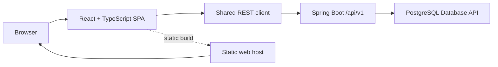

# PLIEGO Frontend Technical Architecture and Implementation Plan v1.0

**Status:** Accepted baseline; frontend stack details updated by [ADR-0007](../adr/0007-frontend-stack-consolidation.md)  
**UX baseline:** [Frontend UX Baseline v1.0](product-design-and-ux-v1.0.md) — `BASELINE APROBADA`  
**Backend baseline:** `backend-v1.0.0` at `8818ed5932af39c6192fa96520820d3423085e2d`

## 1. Current state and constraints

- PLIEGO contains a Java 25 / Spring Boot REST backend, PostgreSQL 18, and a React 19 + TypeScript + Vite 8 frontend. The current production surfaces are the public catalog, edition detail, sign-in, and registration; CUSTOMER task and ADMIN work surfaces remain subsequent implementation phases.
- The API is the frozen business boundary. The frontend must not access PostgreSQL, call database routines directly, or reimplement server-owned business rules.
- The client uses `/api/v1`, bearer authentication, string IDs and money values, Spanish Problem Details, zero-based API pagination, and the existing role permissions.
- The backend does not refresh or revoke tokens. Checkout and other POST commands may be non-idempotent; unknown outcomes require a read before another attempt.
- The backend validates `cardNumber` for CARD, rejects it for TRANSFER, never sends it to PostgreSQL, and returns no card data.

## 2. Selected architecture

Use an independently built React 19 + TypeScript SPA under `frontend/`, bundled by Vite 8 and served as static files. React Router Data Mode owns routes and route-level error boundaries. Browser code calls the existing REST API through one `openapi-fetch` boundary with types generated from the checked-in SpringDoc OpenAPI snapshot.



The static host and backend use separately configured origins. Set `PLIEGO_CORS_ALLOWED_ORIGINS` to the exact deployed frontend origin and the exact development origin. Keep API credentials, signing secrets, and database access out of frontend configuration.

### Runtime boundaries

- **App shell:** role-aware navigation, route resolution, session context, and page-level error boundary.
- **Features:** catalog, identity, profile/addresses, cart/checkout, customer orders, and admin customers/catalog/inventory/orders.
- **Shared API:** typed request/response contracts, bearer header, Spanish Problem Details parsing, page-index conversion, and request cancellation for stale reads.
- **Server state:** TanStack Query for loading, cache, invalidation, and refetch after mutations. No optimistic success for checkout, cancellation, inventory movements, or logistics transitions.
- **Form state:** React Hook Form + Zod for validation and local submission state. Clear password after login response; keep `cardNumber` only in transient checkout memory and clear it on submit, payment-method switch to TRANSFER, route exit, or session teardown.
- **UI foundation:** Tailwind CSS 4 and shadcn/ui with Base UI, layered onto PLIEGO's tokens and existing custom catalog styling. Use Inter Variable for interface text and Literata Variable for editorial display text. Use Lucide React for interface icons.
- **Tests:** Vitest + Testing Library for component behavior and Playwright for critical browser journeys. TanStack Table remains scoped to future ADMIN data grids; Motion waits for an interaction that benefits from animation.
- **Authorization:** route visibility is role-aware for navigation. Backend 401/403 and ownership enforcement remain authoritative; clear in-memory auth and protected cached data on 401.

### Source structure

```text
frontend/
├── src/
│   ├── app/                 # shell, routes, session, page boundaries
│   ├── features/
│   │   ├── auth/
│   │   ├── catalog/
│   │   ├── customer/        # profile, addresses
│   │   ├── cart/
│   │   ├── orders/           # customer and admin views
│   │   ├── admin-customers/
│   │   ├── admin-catalog/
│   │   └── inventory/
│   ├── shared/
│   │   ├── api/               # one HTTP client and wire types
│   │   ├── ui/                # shared controls, feedback, page patterns
│   │   └── lib/               # money, dates, validation, pagination
│   └── styles/
├── .env.example
├── package.json
└── package-lock.json
```

Feature modules may import shared code and API contracts. Shared API code must not import feature UI. Features do not call `fetch` directly or build endpoint URLs independently.

## 3. Route and role contract

| Route group | Access | Entry behavior |
|---|---|---|
| Catalog and edition detail | Guest, CUSTOMER | Default Guest entry; preserve safe catalog intent through sign-in. |
| Sign-in and registration | Guest | Registration creates CUSTOMER only and does not sign in automatically. |
| Cart, checkout, customer orders | CUSTOMER | Require CUSTOMER session; a safe prior intent is restored after login when possible. |
| Profile and addresses | CUSTOMER | Own account only. |
| Admin workspace, customers, catalog, inventory, orders | ADMIN | Successful ADMIN login always enters the ADMIN workspace, never CUSTOMER purchasing. |

Successful login uses the role returned by the backend: CUSTOMER goes to a safe permitted prior intent or Catalog; ADMIN goes to the ADMIN workspace. No role selection is inferred from the route or email.

## 4. API and state handling

- Configure `VITE_API_BASE_URL`; local default is `http://localhost:8080/api/v1`. The variable is a public URL, never a secret.
- Keep JSON IDs and monetary values as strings. Do not parse IDs/money through JavaScript numbers.
- Convert UI page 1 to API `page=0`; convert API indexes back to one-based page presentation. Preserve filters, sort, and page context during navigation.
- Build `Authorization: Bearer …` only in the shared client. Keep the token in memory; do not use localStorage, sessionStorage, cookies, URLs, or logs.
- Parse RFC 9457 responses and branch on HTTP status plus stable `code`. Render Spanish `title`, `detail`, and field violations in context; never show raw server/database messages.
- Reads may be retried. Disable duplicate submits while a command is pending, but do not auto-retry non-idempotent POSTs. If a response is unknown, route to the UX-specified order/cart/movement read path before a later attempt.
- On checkout, send `cardNumber` only with `paymentMethod=CARD`. Validate 12–19 ASCII digits and Luhn locally; backend validation remains authoritative. Do not send CVV/expiry. Omit the property entirely for TRANSFER and clear it when switching methods or submitting. Do not persist, log, capture in telemetry, restore, echo, or display it after submission.
- For catalog search, map only approved filters/sorts. For ADMIN catalog, model Book author/category associations and Edition immutable Book/SKU identities in forms; display backend conflicts without duplicating domain rules.

## 5. Implementation sequence

1. **Foundation:** strict TypeScript settings, environment example, design tokens, shared UI primitives, generated OpenAPI types/client, data router, query cache, and in-memory session.
2. **Guest and identity:** responsive public catalog/detail, sign-in, registration, Spanish Problem Details, role-directed login routing.
3. **Customer journey:** profile and addresses; active cart; checkout with CARD/TRANSFER branches, simulation outcomes, approved/rejected results, order history/detail/cancellation and timeout recovery.
4. **Admin operations:** customer search/status; catalog author/publisher/category/book/edition workspaces; inventory search/movements/entry/adjustment/minimum; order search/detail/sequential transitions/cancellation.
5. **Integration hardening:** connect every surface to the live API, verify CORS and deep links, confirm loading/empty/error/conflict states, protect sensitive transient fields, review responsive and keyboard behavior, and run the approved acceptance suite before release.

Each phase leaves a buildable app. Do not add mock business outcomes or endpoints. If a capability is not present in backend v1, represent its absence and stop at the approved recovery path.

## 6. Deployment and operations

- Build to static assets; host independently from Spring Boot. Configure SPA history fallback for deep links.
- Set `VITE_API_BASE_URL` at build/deploy time to the public backend API origin; configure the matching exact CORS origin server-side.
- Serve production frontend and API over HTTPS. Never place JWT signing/database credentials in `VITE_*` variables.
- Do not add Docker or change backend deployment/migrations for this frontend.

## 7. Deferred decisions and revisit triggers

- Revisit server rendering only if product requirements establish a need for search-engine indexing of public edition pages.
- Revisit JWT persistence only with a security review and a backend-compatible token lifecycle; v1 starts memory-only.
- Analytics, customer support, password recovery, real payments, shipping/tax calculation, and tracking remain outside backend v1 and this implementation.

## 8. Architecture decision record

See [ADR-0006: Standalone React client for the PLIEGO frontend](../adr/0006-frontend-client-architecture.md).

## References

- [React: Build a React app from scratch](https://react.dev/learn/build-a-react-app-from-scratch)
- [Vite: Getting Started](https://vite.dev/guide/)
- [TypeScript Handbook](https://www.typescriptlang.org/docs/handbook/intro)
