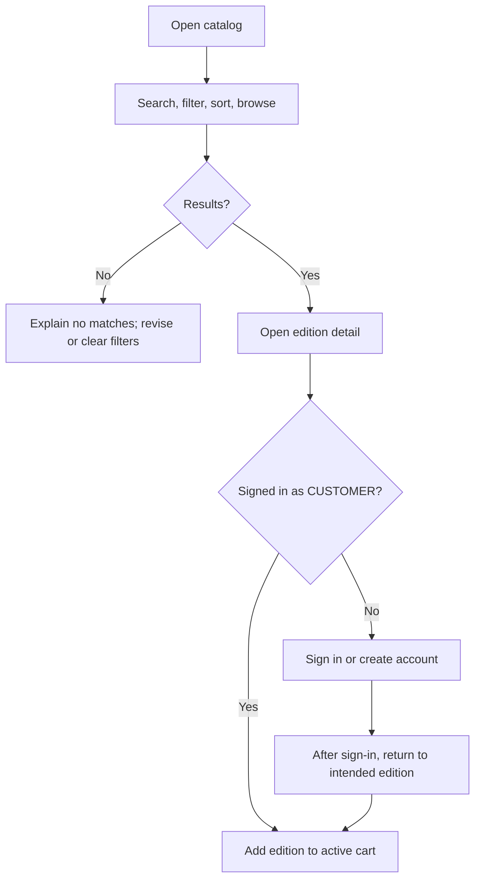
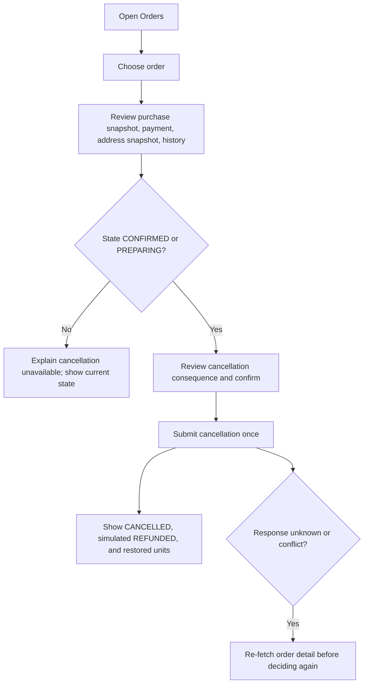

# PLIEGO Frontend UX Baseline v1.0

| Field | Value |
|---|---|
| Status | `BASELINE APROBADA` |
| Backend baseline | `backend-v1.0.0` |
| Backend commit | `8818ed5932af39c6192fa96520820d3423085e2d` |
| Scope | Guest, CUSTOMER, and ADMIN experiences supported by backend v1 |

## 1. Scope, outcomes, and evidence

This document defines user goals, information architecture, flows, states, framework-neutral behavior, and acceptance criteria. It does not add backend capabilities. The four linked artifacts below are authoritative for the v1 boundary:

- [Backend handoff](backend-handoff-v1.0.md)
- [Use-case baseline](../../use-case-baseline-v1.0.md)
- [REST API contract](../../rest-api-contract-v1.0.md)
- [Repository overview](../../README.md)

| Outcome | Role | Evidence and design consequence |
|---|---|---|
| O-01 Find a commercially listed edition and understand its availability | Guest, CUSTOMER | CU-CAT-01/02; show current price and availability in both results and detail; zero stock may still be listed. |
| O-02 Create a CUSTOMER account and enter an authenticated task | Guest, CUSTOMER | CU-AUTH-01/02; registration ends with confirmation and an explicit sign-in step; registration does not create a session. |
| O-03 Maintain personal delivery data and an active cart, then understand the checkout result | CUSTOMER | CU-CUS-01/02, CU-CART-01–04, CU-SAL-01, CU-PAY-01; cart is not a stock reservation; checkout may commit either approved or rejected simulated payment. |
| O-04 Review own orders and cancel only while permitted | CUSTOMER | CU-SAL-02/03; order detail and current state determine available actions. |
| O-05 Maintain catalog, stock, customer access, and order logistics | ADMIN | CU-ADM-SEC-01, CU-ADM-CAT-01–05, CU-INV-01–03, CU-ADM-SAL-01; present business workspaces and only supported actions. |

**Evidence limit:** These sources establish system capabilities and constraints, not customer research, support data, usability findings, product analytics, or validated labels. Navigation and copy choices below are informed design hypotheses for review. No user research or accessibility conformance audit is claimed here. Product success metrics have not been supplied; the criteria in §9 are observable behavior checks, not population-level outcome measures.

## 2. Roles, access, and information boundaries

| Context | Can find or change | Must not be offered as an available capability |
|---|---|---|
| Guest (unauthenticated) | Public catalog search, filters, sorting, edition detail, CUSTOMER registration, sign-in | Cart mutation, checkout, profile, orders, administration |
| CUSTOMER | Public catalog plus own profile, own addresses, active cart, own orders and eligible cancellations | Other customers' data, administrative workspaces, password/email change, password reset, server-side logout, real payment |
| ADMIN | Customer search and ACTIVE/BLOCKED changes; authors, publishers, categories, books, editions; inventory and movement review/changes; all-order search, detail, sequential logistics changes, eligible cancellation | CUSTOMER purchasing/account surfaces as admin operations, physical deletion of catalog entities, carrier tracking, stock reservations, real refunds/payments |

Authorization is enforced on data reads and actions. A role mismatch is a denied state, not a partially authorized screen. A blocked CUSTOMER's existing token stops authorizing protected work; a fresh login for a blocked account returns the same generic invalid-credentials response as other login failures. The UI must not infer or reveal “blocked” from that response.

## 3. Information architecture and navigation

Structure surfaces around the work people need to do. Route labels below are concepts, not approved final copy or a visual specification.

```text
Guest
├── Catalog
│   └── Edition detail
├── Sign in
└── Create CUSTOMER account

CUSTOMER
├── Catalog
│   └── Edition detail → active cart
├── Cart → Checkout
├── Orders
│   └── Order detail → cancel when eligible
└── Account
    ├── Profile
    └── Delivery addresses

ADMIN
├── Orders
│   └── Order detail → next logistics step or eligible cancellation
├── Inventory
│   └── Edition stock and movement history
├── Catalog administration
│   ├── Authors
│   ├── Publishers
│   ├── Categories
│   ├── Books
│   └── Editions
└── Customers
    └── Customer access state
```

### Navigation behavior

- Guest entry is the catalog. Sign-in and account creation remain reachable without losing the current edition/search context where the user entered from.
- CUSTOMER navigation gives direct access to Catalog, Cart, Orders, and Account. Profile and addresses are grouped because both maintain the customer's account/delivery context. Checkout starts from Cart; delivery address selection can link to address management when none is available.
- ADMIN navigation gives direct access to Orders, Inventory, Catalog administration, and Customers. Catalog subareas remain distinct because their objects and rules differ. An admin landing surface is a set of task links only; v1 provides no dashboard metrics.
- After successful login, route using the role returned by the backend: `CUSTOMER` returns to a safe previous intent when one is available and still permitted, otherwise to Catalog; `ADMIN` goes to the ADMIN workspace. The ADMIN workspace is the admin landing surface with task links. An ADMIN login must never default to CUSTOMER purchasing flows.
- Object detail surfaces link back to their parent list. Returning from a detail or sign-in/register should restore non-sensitive list/search context where possible; a changed permission or missing object requires a fresh read and an explanation.
- A customer-facing order and an admin order share the domain object but have different data/action contracts: customer detail is ownership-limited; admin detail includes related inventory movements.
- Use a natural, one-based page model in the interface. The first page is presented as **Page 1** and maps to API `page=0`; increment/decrement at the UI boundary. Derive page count from `totalCount` and `pageSize` because the API has no `totalPages`. An empty result is a successful empty state, not a not-found page. On a stale page after data changes, show the empty/current result and let the person return to the previous or first available page; never display API index zero as “page 0.”

## 4. Principal task flows

### F-01 Discover an edition (Guest or CUSTOMER)



An edition with zero stock can appear in the public catalog; show it as unavailable and do not imply that viewing it reserves stock. A non-publishable or missing edition may resolve to not found; provide a route back to catalog. Guest registration does not create a session; completing it leads to sign-in.

### F-02 Prepare a cart and complete simulated checkout (CUSTOMER)

1. Enter Cart and fetch the current active cart. Show server-provided current unit prices, subtotals, total, availability, and unavailability reason when present. State plainly that the cart does not reserve stock.
2. Let the customer change positive quantities or remove an item. Removal is separate from setting quantity; zero is not a quantity-based delete. After a mutation, show the resulting server state.
3. If the cart is empty, explain that checkout requires an item and link to Catalog. If there is no saved delivery address, link to Address management and return to the cart/checkout intent after save if that intent can safely be retained.
4. At checkout, require a saved address and the supported payment method. The request also requires `simulationOutcome` (`APPROVED` or `REJECTED`); its customer-facing control is an open decision in §10. For `CARD`, collect a 12–19 digit `cardNumber` only in transient checkout state, validate it with Luhn before submission, and include it only in the CARD request. Do not request CVV or expiration date. Do not persist, log, or restore the number after reload; clear it after submission and never echo or display it again in a response, confirmation, order, or later form. For `TRANSFER`, do not show or submit `cardNumber`; switching to TRANSFER clears any previously entered number. The backend does not represent real payment authorization.
5. Submit checkout once. A successful HTTP creation is not synonymous with an approved payment:
   - **APPROVED:** show the returned order as `CONFIRMED`, payment as `APPROVED`, total, and `orderId` as the order identifier. Show `paymentReference` separately as the payment reference (Spanish wording: **referencia de pago**); v1 values use the `SIM-UUID` form. The cart becomes `CHECKED_OUT` and stock was deducted.
   - **REJECTED:** show the created order as `CANCELLED`, payment as `REJECTED`, its `orderId`, and explain that no stock was sold. `paymentReference` is null, so do not show a payment reference. The cart remains `ACTIVE`; a further checkout is a new commercial attempt and can create another order. It must be an explicit customer action after reviewing current cart state, never an automatic retry.
6. On a stock/availability conflict, re-read the cart. If the returned availability/reason identifies affected items, explain those items; otherwise state that checkout could not complete and present the refreshed cart for review without guessing. Preserve safe cart context, offer supported item removal/quantity correction, and require a fresh decision. Availability and price may have changed since the previous read.
7. If the checkout response is unknown after timeout/network loss, do not replay the POST. Take the customer to Orders or offer a direct “check orders” action; fetch the order list/detail to determine whether an order exists before enabling a new checkout attempt. Re-read Cart before any later new attempt.

### F-03 Review or cancel an order (CUSTOMER)



A committed cancellation is non-idempotent. It restores inventory and changes an approved payment to simulated `REFUNDED`; the order and its history remain. `SHIPPED`, `DELIVERED`, and `CANCELLED` orders cannot be cancelled. If state changed since detail loaded, refresh and explain the current allowed action.

### F-04 ADMIN manage customer access

Search/filter customers by query/state → review a customer's summary and current state → choose `BLOCKED` or `ACTIVE` → confirm the state change in the result. A blocked customer's cart and order history are not deleted. The backend provides customer search and state mutation, not a general customer profile/edit workspace. A same-state update is idempotent; after success, refresh the displayed state. If an existing blocked user's request fails, treat the returned authorization/session error as authoritative and route through generic reauthentication behavior.

### F-05 ADMIN maintain catalog and inventory

- In Catalog administration, choose the relevant object area; search/list; create or edit; review validation; activate/deactivate where supported. Books require an author and category; editions require their parent book and an active publisher. Category hierarchy is at most two levels. SKU is fixed after edition creation; book association is fixed after edition creation. Catalog records are deactivated/reactivated rather than physically deleted.
- An inactive Book or Edition is not publicly purchasable. Deactivation of an Author, Publisher, or Category does not by itself invalidate already-existing associations/editions; explain this distinction at the status action where relevant.
- New editions start with zero stock and zero minimum. In Inventory, find the edition, inspect current stock and movement history, then record an entry, adjustment in/out, or minimum-stock threshold. Show the committed stock-before/stock-after result for movement commands. Movements are immutable; corrections use a compensating movement.
- Inventory entry/adjustment commands are non-idempotent. If the response is unknown, inspect the movement history and current stock before deciding whether another movement is needed. A failed insufficient-stock adjustment requires a refreshed current stock and corrected decision.

### F-06 ADMIN progress or cancel an order

Search/filter orders by state/date/customer → open detail and history → offer only the next supported logistics transition: `CONFIRMED → PREPARING → SHIPPED → DELIVERED`. Cancellation is a separate action only in `CONFIRMED` or `PREPARING`. On transition conflict or stale detail, re-fetch detail and present the current state. A transition is non-idempotent; after timeout inspect order detail/history before deciding whether to submit again. No carrier, tracking number, or delivery estimate is supported in v1.

## 5. Screen and surface inventory

“Surface” means a user-goal context; create/edit and state variations can be states within a surface rather than separate API-shaped screens.

| ID | Surface and role | Goal / entry | Required content and actions | Important states and recovery |
|---|---|---|---|---|
| S-01 | Catalog — Guest, CUSTOMER | Discover editions; primary public entry | Search by title/author/ISBN/category; filters for category, price range, language, format; title/price sorting; results with title, authors, publisher, price, availability, detail link; natural pagination | Loading, empty results with filter recovery, unavailable item, request failure with retry for read, stale page |
| S-02 | Edition detail — Guest, CUSTOMER | Assess one edition; catalog result or direct link | Bibliographic/commercial detail, current price/availability, cover attribution where provided; CUSTOMER add-to-cart action; guest sign-in/register path | Not found/non-publishable, unavailable, add conflict/validation, return to prior catalog context |
| S-03 | Sign-in and account creation — Guest | Gain CUSTOMER access; header or gated action | Login email/password; registration email/password/name/optional phone; validation and generic authentication error | Duplicate email, field validation, invalid credentials (including blocked account), request failure; registration success then explicit sign-in |
| S-04 | Cart — CUSTOMER | Review/edit current selection; navigation or add-to-cart | Current availability/reason, quantity, current price/subtotal/total, remove, continue browsing, checkout entry | Empty cart; unavailable item still visible; stock/edition conflict; refreshed totals; session expired |
| S-05 | Checkout — CUSTOMER | Submit an active non-empty cart for a saved address and simulated payment outcome | Address choice; supported payment method and academic outcome; for CARD only, transient Luhn-validated `cardNumber`; for TRANSFER, no card field; no CVV/expiration date; current order total; clear simulated-payment explanation; one submit action | No addresses, empty cart, validation, stale stock/price conflict, approved, rejected, unknown response requiring order inspection; card number cleared after submission and never shown again |
| S-06 | Orders list and order detail — CUSTOMER | Review own purchase history; after checkout or navigation | Paginated summaries; detail with purchase/address/payment snapshots and status history; cancel only when eligible | No orders; missing/not-owned order gives non-disclosing unavailable state; eligible/ineligible cancellation; stale state; unknown cancellation result |
| S-07 | Account — CUSTOMER | Maintain personal details and delivery addresses | Profile name/phone; address list and create/edit/delete/set-primary; no email/password editing | No addresses; form validation; delete confirmation; stale or session-invalid data; validation preserves correctable non-secret inputs |
| S-08 | Customer access — ADMIN | Find a customer and change access state | Search/query/state filters, paginated summaries, current ACTIVE/BLOCKED state, block/reactivate action | No matches; stale current state; action denied/validation; refresh result; blocked customer account behavior is not exposed as a distinct login diagnosis |
| S-09 | Catalog administration — ADMIN | Maintain bibliographic/commercial records | Separate Authors, Publishers, Categories, Books, Editions workspaces; search/list; create/edit/status actions; relevant associations and immutable identity constraints | Empty results; validation/domain conflicts with input correction; inactive dependencies; active/inactive publication effect; no physical delete |
| S-10 | Inventory — ADMIN | Inspect or change an edition's stock | Search by edition/title/SKU and low-stock filter; stock/current minimum/state; movement history; entry, adjustment in/out, set minimum | No matches; low-stock state; insufficient adjustment; stale count; movement success with before/after; unknown POST outcome inspected before retry |
| S-11 | Orders and logistics — ADMIN | Review all orders and advance/cancel eligible ones | Filters by state/date/customer; detail, purchase/payment snapshot, history, related inventory movements; next transition only; separate eligible cancel action | Empty results; stale state; invalid transition; unknown command outcome → re-fetch order detail/history; non-cancellable state |
| S-12 | Role shell/session recovery — CUSTOMER, ADMIN | Orient within authorized workspace and recover changed/expired authority | Role-appropriate navigation, current account/logout action, Spanish problem feedback | Expired/invalid token or blocked CUSTOMER: stop protected actions, clear local authenticated context, explain sign-in is needed, return to sign-in; role-denied: show Spanish access-denied state without exposing protected data |

## 6. State and recovery rules

| Trigger/state | User-visible contract | Safe next action |
|---|---|---|
| No search matches / no orders / no customer or admin records | Say the search completed and found nothing; distinguish an empty result from load failure. Keep filters editable. | Revise/clear filters; return to parent task. |
| `available=false` or unavailability reason in cart | Keep the affected item visible; name the reason when supplied; do not imply stock is held. | Change/remove item or browse; refresh before checkout decision. |
| Checkout availability/stock conflict (`409`) | State that cart availability changed; re-read cart and show updated price/availability. Do not say an order was placed. | Review affected item(s), then make a new deliberate decision. |
| Checkout returns `APPROVED` | Show order `CONFIRMED`, payment `APPROVED`, amount, and `orderId` as the order identifier; label `paymentReference` separately as the payment reference (“referencia de pago”). | Open order detail/history. |
| Checkout returns `REJECTED` with creation success | Show order `CANCELLED`, payment `REJECTED`; explicitly say no stock sale occurred and cart remains active. | Review cart and intentionally start a new attempt if desired. |
| Unknown result of checkout/cancellation/logistics/inventory POST | Mark outcome unconfirmed; prevent automatic replay. Preserve the user on a recovery path, not a success claim. | Read orders/order detail/history or inventory movements/current stock, according to the command, before another mutation. |
| Cancellation not allowed / stale order | Show freshly fetched state and explain cancellation is available only in `CONFIRMED` or `PREPARING`. | Continue viewing history; no unsupported appeal/undo is promised. |
| Admin order state changed concurrently | Refresh detail; show current state and only the next valid logistics action. | Decide from refreshed state; never jump states. |
| Login invalid credentials (including blocked) | Use the same generic Spanish authentication feedback; do not disclose whether the email exists or is blocked. | Correct credentials or contact the product's separately defined support route if one exists; do not invent password reset. |
| Protected call returns expired/invalid/inactive actor (`401`) | Stop protected mutations, discard the current client auth context, explain sign-in is required; preserve only safe return context. | Sign in again, then reload protected data before resuming. No refresh-token flow exists. |
| Protected call returns role denied (`403`) | Show access unavailable in Spanish; do not render data from the denied response. | Navigate to the permitted role context or sign in with an authorized account. |
| Read/network failure | Distinguish unavailable data from an empty result; retain filters/form context where safe and disclose whether data may be stale. | Retry the read; GET reads are safe to repeat. |
| Form validation/domain conflict | Use Spanish human-facing messages; connect field errors to the affected values, preserve correctable input, and show a specific next step. Use stable API code/status for behavior, not brittle text matching. | Correct values or refresh dependent entities; do not claim a mutation succeeded until confirmed. |

The access token lasts 30 minutes, with no refresh token and no server logout/revocation endpoint. “Sign out” means removing the token from the client; it must not be described as revoking an already-issued token elsewhere. Exact token persistence across reloads is an open security/product decision (§10).

## 7. Framework-neutral interface behavior contracts

These contracts define observable behavior, not layout, styling, component choices, or frontend technology.

| Contract | Content and controls | Permissions, transitions, and persistence | Inclusive/degraded behavior |
|---|---|---|---|
| IC-01 Discovery | Search/filter/sort controls expose active criteria; result and detail values come from public catalog data. Availability and current price are explicit. Guest gets sign-in/register when attempting a CUSTOMER-only action. | Public read; CUSTOMER cart add requires authenticated CUSTOMER. Preserve non-sensitive query and intended edition through sign-in where possible; re-fetch availability on return. | Search and result order remain understandable at narrow width and after text expansion; avoid losing item identity or availability when content wraps. Read failures remain distinct from zero results. |
| IC-02 Authentication | Registration and sign-in use API-supported fields only. Registration success is a confirmation with a sign-in action. Auth errors display Spanish Problem Details text without distinguishing blocked, absent, or incorrect credentials. | Register creates an ACTIVE CUSTOMER but no token. Login yields role and expiring bearer token. Logout clears the token only on this client. Failed/expired authority cannot leave protected data actionable. | Preserve safe form values after recoverable errors; never echo passwords or tokens. Field feedback identifies the field and correction. Keyboard/input users can reach submit, errors, and recovery actions; route change announces/lands at the new task heading. |
| IC-03 Cart and checkout | Cart uses latest returned price/subtotal/total and supplied availability reason. Quantity must be positive; remove is explicit. Checkout presents saved address, payment method, total, and the academic simulation outcome per §10. CARD requires a transient 12–19 digit, Luhn-validated `cardNumber`; TRANSFER has no card field. Never ask for CVV or expiration date. | `cardNumber` is sent only for CARD, is never persisted, logged, or restored after reload, and is cleared after submission; never echo/display it in results or later surfaces. Checkout is a single non-idempotent command. Approved and rejected are distinct completed outcomes. Unknown response triggers order inspection before another checkout. | Keep cart context through validation/conflict but do not retain card data. Do not optimistically label an order paid or confirmed. At narrow width and zoom, preserve item, quantity, price, availability, and remove/change actions together logically. |
| IC-04 Orders and cancellation | Customer sees own summaries and immutable snapshots/history. Status text is understandable and paired with the domain state where operationally useful. Cancellation consequence and current eligibility are clear before confirmation. | Customer reads own order only. Cancel action exists only for `CONFIRMED`/`PREPARING`; response updates order/payment/stock consequence. Unknown outcome triggers detail read. | Order history remains readable without relying on color alone. On state refresh, keep order identity and reading context; errors include what is known and the next safe action. |
| IC-05 Admin operational workspaces | Each list exposes its supported search/filter and relevant data; forms explain dependency/identity rules. Stock commands display the backend-confirmed before/after counts. Movement and order histories are reviewable. | ADMIN only. Catalog state changes follow v1 lifecycle; stock movements are non-idempotent; status updates may be same-state idempotent; logistics offers only the next state. Refresh dependent data after conflict or unknown command result. | Dense data preserves row identity and meaningful labels through reflow; actions remain reachable without drag-only interaction. Read and command failures are distinguishable. |
| IC-06 Pagination | Display one-based position, total result count, and page navigation; empty state has no page-zero label. | Translate UI page 1 to API page 0. Respect pageSize 1–50 (default 20); derive page count from totalCount. Preserve filters/sort when moving pages. | Page controls remain operable with keyboard and touch, with current page communicated as state. Text expansion must not truncate the only route to previous/next results. |
| IC-07 Shared state, errors, and session | Spanish API title/detail/validation feedback is shown in context, with stable machine code used for behavior. Expose trace ID where support/debug workflow requires it; never show raw SQL or secrets. | Re-check permissions on every protected view/command. 401 clears local auth context; 403 denies that task. Re-entering a task reloads current state. GET can retry; non-idempotent POST cannot be blindly replayed after unknown outcome. | Focus/reading position moves to the new surface or error summary after navigation/submission; errors are associated with correctable inputs. Preserve safe context across reflow, interruption, and re-entry. Detailed WCAG/ARIA review is deferred. |

## 8. Content and terminology rules

- The API's Spanish Problem Details and the repository's Spanish user-facing error requirement make Spanish the provisional interface language. Final product language, regional vocabulary, and localization scope still require owner confirmation.
- Prefer customer language (“book/edition,” “cart,” “order,” “available”) over internal routine, table, or HTTP terms. Explain `APPROVED`, `REJECTED`, `REFUNDED`, and logistics statuses in user-facing language; do not make the person infer the outcome from a code or color.
- Present USD and current server-returned totals. v1 defines order total as item subtotal; it does not provide configurable tax or shipping calculation. Do not add a shipping fee, delivery estimate, or tax line.
- Public edition detail may expose cover attribution metadata when supplied. Do not expose inventory movement or admin-only stock details to Guest/CUSTOMER.
- Keep authentication feedback generic. Do not invent password recovery, email verification, customer support, or a way for a visitor to create an ADMIN account.

## 9. UX acceptance criteria

These are observable handoff criteria for a later implementation review; no frontend exists and no acceptance run is claimed. Verify with synthetic accounts/data at the user-facing boundary and inspect the matching API/read state. Do not use real credentials or payment data.

| ID | Given / when | Then observable result |
|---|---|---|
| AC-01 | A Guest opens Catalog, searches/filters, and opens an edition | Public discovery works without a token; empty results remain a successful empty state; detail shows current price and availability. A zero-stock edition is not presented as purchasable. |
| AC-02 | A Guest registers valid CUSTOMER data | A CUSTOMER account is confirmed, then the person is offered sign-in; no authenticated state is implied until login succeeds. Duplicate email and validation errors preserve correctable non-secret data and provide Spanish recovery feedback. |
| AC-03 | Any paginated list is at its first result page | UI says Page 1 (or equivalent natural first-page position) while the request uses API `page=0`; page size stays within 1–50, total count is used, and an empty result is not rendered as not found. |
| AC-04 | A CUSTOMER views an active cart containing an unavailable item or changed stock/price | The affected item, current availability and any supplied reason, and current total are shown. A checkout conflict causes cart re-read and a clear review path; the UI does not report success or silently replay checkout. |
| AC-05 | A CUSTOMER completes checkout with `APPROVED` | The returned order is shown as `CONFIRMED`/`APPROVED`, with amount, `orderId` identified as the order identifier, and `paymentReference` separately identified as the payment reference (“referencia de pago”); customer can open order detail. |
| AC-06 | A CUSTOMER completes checkout with `REJECTED` | The created order is shown as `CANCELLED`/`REJECTED` with its `orderId`; copy explains that no stock sale occurred and the cart remains active. Since `paymentReference` is null, no payment reference is shown. Any further attempt requires a deliberate new action after current cart review. |
| AC-07 | Checkout times out after submission with no known response | The interface reports an unknown outcome, offers order inspection, and does not issue another checkout POST automatically. A new attempt is not offered as a resolved outcome until orders and current cart have been inspected. |
| AC-08 | A CUSTOMER opens orders in each order state | Detail shows purchase/address/payment snapshot and state history. Cancel is offered only in `CONFIRMED` or `PREPARING`; ineligible state explains why. |
| AC-09 | Customer cancellation returns or loses its response | A confirmed result shows `CANCELLED`, simulated `REFUNDED` when previously approved, and restored units. An unknown response causes order-detail refresh before another command. |
| AC-10 | ADMIN opens an order detail | Only `CONFIRMED→PREPARING`, `PREPARING→SHIPPED`, or `SHIPPED→DELIVERED` is offered as a logistics action; cancellation is separate and only available from `CONFIRMED`/`PREPARING`. A conflict/timeout triggers refresh before another transition. |
| AC-11 | ADMIN records an inventory entry or adjustment and response is lost | The interface asks the admin to inspect current stock and movement history before deciding on another non-idempotent command; confirmed movement displays backend-returned stock before/after. |
| AC-12 | A CUSTOMER token expires or a CUSTOMER is blocked after sign-in | Protected work stops on `401`; local authenticated context is cleared and sign-in is required. Login feedback does not reveal blocked vs invalid credentials. No action is falsely shown as committed. |
| AC-13 | A non-ADMIN requests an admin surface or action | Access is denied in Spanish and protected response data/actions are not rendered. CUSTOMER-only ownership also prevents opening another customer's order. |
| AC-14 | Search/list or form is used at constrained width, zoom, keyboard, or touch | Task context and critical values/actions remain available and ordered; fields/errors and current status remain identifiable; no required action depends solely on dragging, color, hover, or a transient visual animation. Detailed conformance evidence is deferred to the dedicated accessibility phase. |
| AC-15 | A CUSTOMER submits checkout with `CARD` or `TRANSFER` | CARD requires a 12–19 digit, Luhn-valid `cardNumber`; it is sent only for CARD, is not persisted/logged/restored after reload, and is cleared after submission without appearing in any result or later surface. No CVV or expiration date is requested. TRANSFER shows and submits no `cardNumber` and discards a previously entered value when selected. |
| AC-16 | Login succeeds for a CUSTOMER or ADMIN | Routing uses the returned role: CUSTOMER goes to a safe permitted previous intent when available, otherwise Catalog; ADMIN goes to the ADMIN workspace. ADMIN is never routed into CUSTOMER purchasing by default. |

## 10. Unresolved decisions and risks

| Decision / risk | Options and consequence | Owner and resolution gate |
|---|---|---|
| How to expose required `simulationOutcome` | Show an explicit, prominent academic simulator control with APPROVED/REJECTED; or define an approved demo/test harness behavior outside the ordinary CUSTOMER interaction. Hiding the required request value without a deterministic product rule would force implementation to invent behavior. Neither option may imply real authorization. The approved baseline requires support for both outcomes and their distinct post-checkout states. | Product owner + backend/API owner; resolve before detailed checkout form implementation. |
| Customer-facing language and terms | Spanish is strongly indicated by API errors and project context, but regional wording, English support, and localization are not specified. | Product/content owner; approve before final UX copy. |
| Token storage and reload behavior | Keep token only in transient client state (less persistence, re-login on reload) or persist it for session continuity (more exposure if compromised). Backend provides bearer JWT, no cookie/refresh/logout. | Security/product owner; resolve before frontend security design. |
| Session and pending-form re-entry | Decide which safe non-sensitive tasks/search state and checkout address choice survive auth expiry/reload; never retain password/token in restored form content. | Product/engineering; validate against recovery/security policy before implementation. |
| Cart conflict detail | API cart exposes item availability/reason and checkout may reject for current stock/availability. Validate whether all relevant conflicts can be mapped to a useful item-level explanation; otherwise use an order-level conflict with refreshed cart. | Backend/API owner; confirm with real API responses before copy lock. |
| Pagination interaction pattern | One-based page navigation is required conceptually. Numbered pages vs previous/next or load-more depends on exhaustive review, comparison, and return-position evidence not present here. | Product/design; decide after task-based IA/usability validation, preserving page 1 semantics either way. |
| Admin list density and catalog subnavigation | Separate subarea links are supported by the task model; priority/frequency evidence is absent, so hierarchy and default entry are provisional. | Admin stakeholders; resolve in an admin task walkthrough before visual design. |
| Language of backend validation details | Project guidance requires Spanish human-facing messages, while some contract examples show low-level English validation text. Display approved Spanish content and use stable API code/status for behavior; confirm deployed API wording/mapping. | Backend/content owner; reconcile before integration acceptance. |
| Analytics and support route | No analytics purpose, retention policy, or support destination is defined. Do not capture form contents or promise support links by assumption. | Product/privacy owner; decide before instrumentation or support copy. |
| No password reset, email change, password change, remote logout, real payment, shipping fee, or tracking | These are absent from v1. Users may expect some of them; surfaces must not imply availability. Any inclusion requires a later approved capability/change. | Product owner; scope change gate. |

## 11. Baseline status and history

**Document status:** `BASELINE APROBADA`

**Baseline:** Frontend UX/IHC v1.0, covering Guest, CUSTOMER, and ADMIN behavior against `backend-v1.0.0` at `8818ed5932af39c6192fa96520820d3423085e2d`.

| Version | Date | Status | Description |
|---|---|---|---|
| 1.0 | 2026-09-23 | BASELINE APROBADA | Approved the role-aware information architecture, 12 goal-based surfaces, task flows, state/recovery rules, behavior contracts, and acceptance criteria. Final review clarified CARD-only Luhn-validated transient `cardNumber` handling, separate `orderId` and `paymentReference` labels, and role-based post-login routing. |

The open decisions in §10 remain explicit owners/gates for detailed interaction and implementation work; they do not expand the approved v1 capability boundary or change this baseline status.
