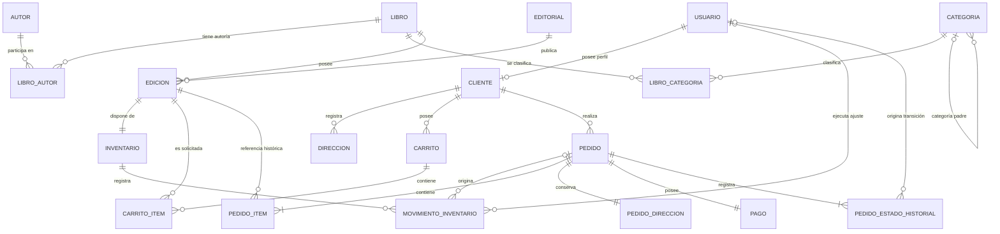
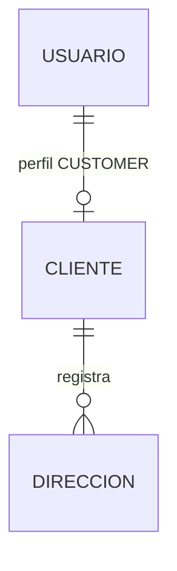
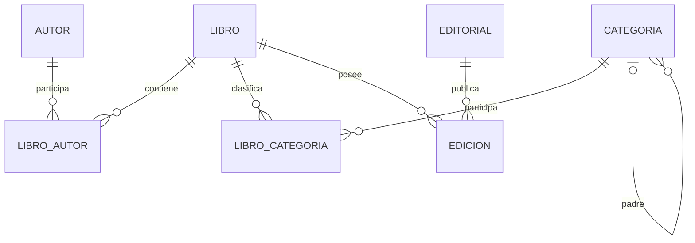
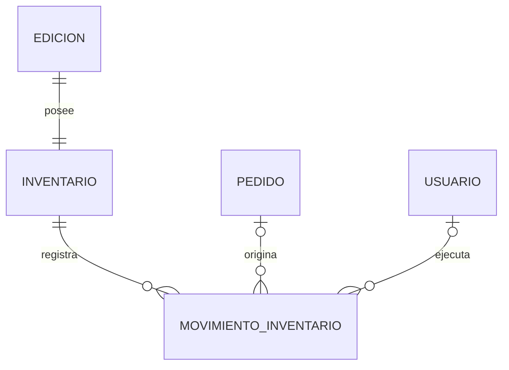
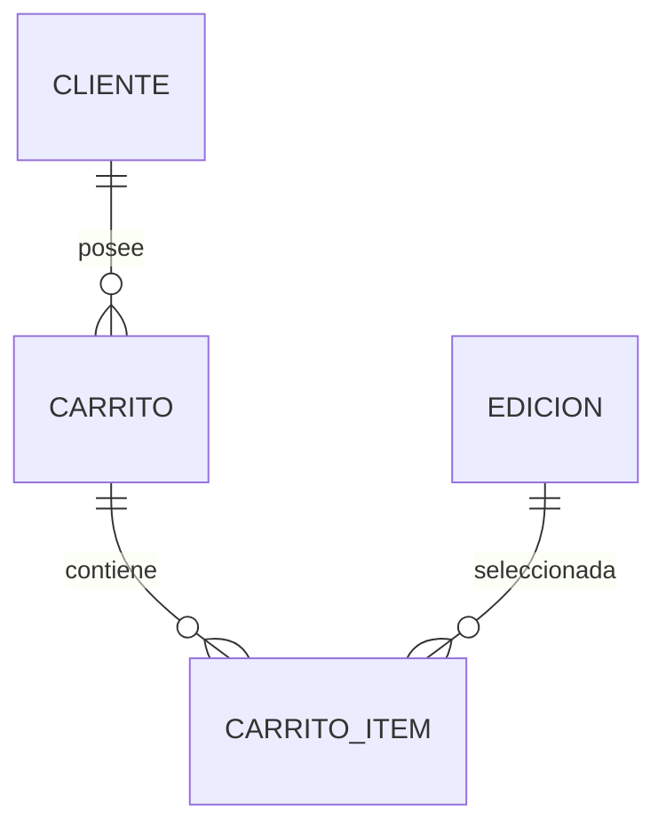
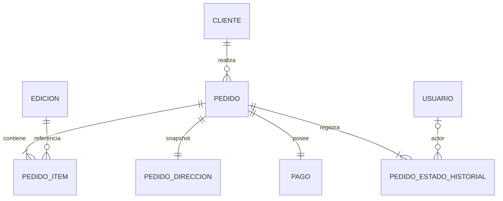

# PLIEGO — DER Lógico v1.0

**Documento:** DERL-PLIEGO-001  
**Versión:** 1.1  
**Estado:** BASELINE APROBADA  
**Fecha:** 2026-09-23  
**Proyecto:** PLIEGO  
**Tipo de documento:** Modelo lógico de datos / Diagrama Entidad–Relación lógico  
**Documento fuente:** `docs/requirements/use-case-baseline-v1.0.md`  
**Ámbito:** Dominio persistente de PLIEGO v1  
**Siguiente artefacto:** Diccionario de Datos v1.0  

---

## 1. Propósito

Este documento define el **modelo lógico de datos de PLIEGO v1** derivado de la *Use Case Baseline v1.0*. Su objetivo es fijar, antes del diseño físico de PostgreSQL:

- entidades persistentes;
- identificadores lógicos;
- atributos necesarios;
- relaciones;
- cardinalidades;
- opcionalidad;
- claves alternativas;
- dependencias de existencia;
- restricciones semánticas;
- dominios controlados;
- decisiones de normalización;
- trazabilidad hacia casos de uso y reglas de negocio.

El modelo lógico es independiente de detalles físicos tales como:

- tipos concretos de PostgreSQL;
- tamaños `VARCHAR`;
- secuencias;
- `IDENTITY`;
- índices;
- nombres físicos definitivos;
- sintaxis SQL;
- Stored Procedures;
- Functions;
- Triggers;
- estrategia exacta de locking.

Esos elementos pertenecen a etapas posteriores.

---

# 2. Criterios metodológicos

El DER lógico se deriva mediante la secuencia:

```text
Use Case Baseline
        ↓
Entidades de dominio
        ↓
Relaciones y cardinalidades
        ↓
Identificadores y atributos
        ↓
Restricciones semánticas
        ↓
Normalización
        ↓
DER lógico
```

Se aplican los siguientes principios:

1. **Trazabilidad:** toda entidad persistente debe estar justificada por al menos un caso de uso, requisito o regla de negocio.
2. **No sobre-modelado:** no se incorporan entidades correspondientes a funcionalidades fuera de PLIEGO v1.
3. **Separación conceptual:** obra bibliográfica (`Libro`) y unidad comercial (`Edicion`) son conceptos distintos.
4. **Historia inmutable:** Pedido, Pago, movimientos de inventario y sus snapshots preservan el estado comercial histórico.
5. **Fuente única de verdad:** cada dato mutable posee una entidad responsable.
6. **Normalización:** el modelo transaccional busca tercera forma normal, salvo desnormalizaciones históricas deliberadas y justificadas.
7. **Simplicidad académica:** no se introducen entidades, catálogos o abstracciones cuya complejidad no esté justificada por los casos de uso.

---

# 3. Alcance del DER lógico

El modelo comprende las 19 entidades persistentes autorizadas por la Use Case Baseline:

1. Usuario
2. Cliente
3. Direccion
4. Autor
5. Editorial
6. Categoria
7. Libro
8. LibroAutor
9. LibroCategoria
10. Edicion
11. Inventario
12. MovimientoInventario
13. Carrito
14. CarritoItem
15. Pedido
16. PedidoItem
17. PedidoDireccion
18. Pago
19. PedidoEstadoHistorial

No se incorpora ninguna entidad adicional de negocio.

---

# 4. Clarificaciones lógicas derivadas de la baseline

Durante la transformación de casos de uso a modelo lógico se hacen dos aclaraciones necesarias para representar requisitos ya aprobados.

## 4.1 Trazabilidad de MovimientoInventario hacia Pedido

Los movimientos de tipo:

- `SALE`;
- `CANCELLATION`;

son generados por operaciones sobre un Pedido. Para satisfacer la trazabilidad exigida por CU-SAL-01, CU-SAL-03 y RNF-012, `MovimientoInventario` podrá referenciar al `Pedido` que originó el movimiento.

Esto **no crea una nueva funcionalidad**; materializa una relación ya implícita en los casos de uso.

Regla:

- movimientos `SALE` y `CANCELLATION` → Pedido origen obligatorio;
- movimientos administrativos → Pedido origen ausente.

## 4.2 Origen de PedidoEstadoHistorial

Las transiciones de Pedido pueden ser producidas:

- por un Usuario;
- automáticamente por el sistema dentro de un proceso de negocio.

Por ello `PedidoEstadoHistorial` registra:

- el origen de la transición (`USER` o `SYSTEM`);
- el Usuario actor cuando el origen sea `USER`.

Esto permite representar correctamente transiciones automáticas derivadas del pago sin crear una entidad artificial denominada “Sistema”.

---

# 5. Convenciones del modelo lógico

## 5.1 Notación de atributos

En las especificaciones:

- **PK** = identificador primario lógico.
- **FK** = referencia lógica a otra entidad.
- **AK** = clave alternativa o unicidad lógica.
- **M** = atributo obligatorio.
- **O** = atributo opcional.
- **D** = atributo derivable, no necesariamente persistido.

La decisión final sobre qué atributos derivados se almacenan se realizará en el modelo físico, siempre preservando las reglas de esta baseline.

## 5.2 Identificadores

Las entidades principales utilizan identificadores internos independientes de atributos comerciales.

Las entidades asociativas puras utilizan identificadores compuestos por las entidades que relacionan cuando esto expresa mejor su identidad lógica.

## 5.3 Terminología

Los nombres aquí son **nombres lógicos**, no nombres SQL definitivos.

Ejemplo:

```text
PedidoEstadoHistorial
```

podrá posteriormente mapearse físicamente a:

```text
pedido_estado_historial
```

sin alterar el modelo lógico.

---

# 6. Vista general del DER



> El diagrama muestra cardinalidad estructural. Las restricciones dependientes de estado, como “Libro `ACTIVE` debe poseer al menos un Autor”, se especifican como invariantes y no deben inferirse exclusivamente de la notación gráfica.

---

# 7. Submodelo de Identidad y Cliente

## 7.1 Usuario

### Propósito

Representa una identidad autenticable dentro de PLIEGO.

### Identificador

- **UsuarioId** — PK, M.

### Atributos

| Atributo lógico | Rol | Obligatoriedad | Descripción |
|---|---|---|---|
| UsuarioId | PK | M | Identificador interno |
| EmailNormalizado | AK | M | Email canónico usado para identidad |
| PasswordHash | — | M | Hash de contraseña |
| Rol | dominio | M | `CUSTOMER` o `ADMIN` |
| Estado | dominio | M | `ACTIVE` o `BLOCKED` |
| FechaCreacion | — | M | Creación de la cuenta |
| FechaActualizacion | — | M | Última modificación relevante |

### Claves

- PK: `UsuarioId`
- AK: `EmailNormalizado`

### Reglas

- Email normalizado es único.
- PasswordHash nunca representa contraseña en texto plano.
- Todo Usuario `CUSTOMER` debe poseer exactamente un Cliente.
- Un Usuario `ADMIN` no requiere Cliente.
- Usuario no se elimina físicamente en v1.

### Casos de uso

- CU-AUTH-01
- CU-AUTH-02
- CU-ADM-SEC-01

---

## 7.2 Cliente

### Propósito

Representa el perfil comercial de un Usuario con rol `CUSTOMER`.

### Identificador

- **ClienteId** — PK, M.

### Atributos

| Atributo | Rol | Oblig. |
|---|---|---|
| ClienteId | PK | M |
| UsuarioId | FK + AK | M |
| Nombres | — | M |
| Apellidos | — | M |
| Telefono | — | O |
| FechaCreacion | — | M |
| FechaActualizacion | — | M |

### Claves

- PK: `ClienteId`
- AK: `UsuarioId`

### Relación

```text
Usuario 1 ───── 0..1 Cliente
Cliente ───── exactamente 1 Usuario
```

Restricción condicional:

```text
Usuario.Rol = CUSTOMER  => exactamente 1 Cliente
Usuario.Rol = ADMIN     => 0 Cliente en v1
```

### Casos de uso

- CU-AUTH-01
- CU-ADM-SEC-01
- CU-CUS-01

---

## 7.3 Direccion

### Propósito

Representa una dirección reutilizable del Cliente para futuros checkouts.

### Identificador

- **DireccionId** — PK, M.

### Atributos

| Atributo | Rol | Oblig. |
|---|---|---|
| DireccionId | PK | M |
| ClienteId | FK | M |
| Alias | — | M |
| Destinatario | — | M |
| DireccionLinea1 | — | M |
| DireccionLinea2 | — | O |
| Ciudad | — | M |
| Provincia | — | M |
| PaisCodigo | — | M |
| CodigoPostal | — | O |
| Referencia | — | O |
| Telefono | — | M |
| EsPrincipal | — | M |
| FechaCreacion | — | M |
| FechaActualizacion | — | M |

### Cardinalidad

```text
Cliente 1 ───── 0..N Direccion
Direccion ───── exactamente 1 Cliente
```

### Restricciones

- Como máximo una Dirección por Cliente puede tener `EsPrincipal = true`.
- Puede existir un Cliente sin Dirección principal.
- Direccion puede eliminarse físicamente.
- Pedido no depende históricamente de Direccion; utiliza PedidoDireccion.

### Casos de uso

- CU-CUS-02
- CU-SAL-01

---

# 8. Submodelo de Catálogo

## 8.1 Autor

### Propósito

Representa una persona o identidad autoral asociable a Libros.

### Identificador

- **AutorId** — PK, M.

### Atributos

| Atributo | Rol | Oblig. |
|---|---|---|
| AutorId | PK | M |
| Nombre | — | M |
| Biografia | — | O |
| Estado | dominio | M |
| FechaCreacion | — | M |
| FechaActualizacion | — | M |

### Reglas

- `Nombre` no es único.
- Estado: `ACTIVE` / `INACTIVE`.
- Autor inactivo no puede incorporarse a nuevas relaciones de autoría.
- Las relaciones existentes se conservan.

---

## 8.2 Editorial

### Propósito

Representa la editorial responsable de una Edición.

### Identificador

- **EditorialId** — PK, M.

### Atributos

| Atributo | Rol | Oblig. |
|---|---|---|
| EditorialId | PK | M |
| Nombre | — | M |
| Descripcion | — | O |
| Estado | dominio | M |
| FechaCreacion | — | M |
| FechaActualizacion | — | M |

### Reglas

- Una Editorial inactiva no puede asignarse a una Edición nueva.
- La inactivación no elimina ni invalida históricamente Ediciones existentes.
- El nombre no se declara clave única en esta baseline.

---

## 8.3 Categoria

### Propósito

Representa una categoría o subcategoría temática.

### Identificador

- **CategoriaId** — PK, M.

### Atributos

| Atributo | Rol | Oblig. |
|---|---|---|
| CategoriaId | PK | M |
| CategoriaPadreId | FK autorreferente | O |
| Nombre | — | M |
| Slug | AK | M |
| Descripcion | — | O |
| Estado | dominio | M |
| FechaCreacion | — | M |
| FechaActualizacion | — | M |

### Claves

- PK: `CategoriaId`
- AK: `Slug`

### Cardinalidad autorreferente

```text
CategoriaPadre 1 ───── 0..N Subcategorias
Subcategoria ───────── 0..1 CategoriaPadre
```

### Invariantes

- `CategoriaPadreId = NULL` identifica categoría raíz.
- Una categoría cuyo `CategoriaPadreId` no sea nulo es una subcategoría.
- Una subcategoría no puede ser padre de otra categoría.
- Una categoría no puede ser padre de sí misma.
- No pueden existir ciclos.
- Profundidad máxima: 2.
- `Slug` único globalmente (ver §13).
- La restricción de profundidad se implementará en el Database API Contract (trigger o validación procedural con lectura del padre).
- Categoría inactiva no puede asignarse a nuevos Libros.

---

## 8.4 Libro

### Propósito

Representa la obra bibliográfica independiente de sus ediciones comerciales.

### Identificador

- **LibroId** — PK, M.

### Atributos

| Atributo | Rol | Oblig. |
|---|---|---|
| LibroId | PK | M |
| Titulo | — | M |
| Subtitulo | — | O |
| Sinopsis | — | O |
| Estado | dominio | M |
| FechaCreacion | — | M |
| FechaActualizacion | — | M |

### Reglas

- `Titulo` no es clave única.
- Un Libro puede poseer varias Ediciones.
- Un Libro `ACTIVE` debe poseer al menos un Autor.
- Un Libro `ACTIVE` debe poseer al menos una Categoría.
- No existe DELETE físico normal.

---

## 8.5 LibroAutor

### Propósito

Resuelve la relación N:M entre Libro y Autor y conserva el orden de autoría.

### Identificador lógico

- **(LibroId, AutorId)** — PK compuesta.

### Atributos

| Atributo | Rol | Oblig. |
|---|---|---|
| LibroId | PK + FK | M |
| AutorId | PK + FK | M |
| OrdenAutoria | AK parcial | M |

### Restricciones

- No puede repetirse el mismo Autor dentro del mismo Libro.
- `OrdenAutoria > 0`.
- Dentro de un mismo Libro no pueden existir dos autores con el mismo `OrdenAutoria`.
- El reordenamiento debe ejecutarse en una única transacción (el modelo físico definirá la técnica: constraint diferido o intercambio procedural); quitar el último autor de un Libro `ACTIVE` se rechaza.

Clave alternativa lógica:

```text
(LibroId, OrdenAutoria)
```

### Cardinalidad

```text
Libro 1 ───── 0..N LibroAutor
Autor 1 ───── 0..N LibroAutor
```

Invariante de estado:

```text
Libro.Estado = ACTIVE => al menos 1 LibroAutor
```

---

## 8.6 LibroCategoria

### Propósito

Resuelve la relación N:M entre Libro y Categoria.

### Identificador lógico

- **(LibroId, CategoriaId)** — PK compuesta.

### Atributos

| Atributo | Rol | Oblig. |
|---|---|---|
| LibroId | PK + FK | M |
| CategoriaId | PK + FK | M |

### Restricciones

- No puede repetirse la misma Categoría para el mismo Libro.
- Una Categoría inactiva no puede agregarse a una nueva relación.

### Cardinalidad

```text
Libro 1 ───── 0..N LibroCategoria
Categoria 1 ─ 0..N LibroCategoria
```

Invariante:

```text
Libro.Estado = ACTIVE => al menos 1 LibroCategoria
```

---

## 8.7 Edicion

### Propósito

Representa la unidad comercial física vendible en PLIEGO.

### Identificador

- **EdicionId** — PK, M.

### Atributos

| Atributo | Rol | Oblig. |
|---|---|---|
| EdicionId | PK | M |
| LibroId | FK | M |
| EditorialId | FK | M |
| SKU | AK | M |
| ISBN13 | AK condicional | O |
| Idioma | — | M |
| Formato | dominio | M |
| NumeroPaginas | — | M |
| FechaPublicacion | — | O |
| Precio | — | M |
| PortadaUrl | — | O |
| PortadaLicencia | — | O condicional |
| PortadaFuenteUrl | — | O condicional |
| PortadaAtribucion | — | O |
| Estado | dominio | M |
| FechaCreacion | — | M |
| FechaActualizacion | — | M |

### Claves

- PK: `EdicionId`
- AK: `SKU`
- AK condicional: `ISBN13` cuando exista

### Relaciones

```text
Libro 1 ───── 0..N Edicion
Edicion ───── exactamente 1 Libro

Editorial 1 ─ 0..N Edicion
Edicion ───── exactamente 1 Editorial
```

### Invariantes

- Precio > 0.
- NumeroPaginas > 0.
- ISBN13, cuando exista, debe ser válido y único.
- Formato: `PAPERBACK` o `HARDCOVER`.
- Una Edición solo es comercialmente publicable si:
  - `Edicion.Estado = ACTIVE`; y
  - `Libro.Estado = ACTIVE`.
- `LibroId` y `SKU` son estables después de la creación.
- Si existe `PortadaUrl`, deben existir licencia y fuente identificables.
- La Edición no almacena stock.

---

# 9. Submodelo de Inventario

## 9.1 Inventario

### Propósito

Constituye la única fuente de verdad de existencias para una Edición.

### Identificador lógico

Dado que PLIEGO v1 establece una relación obligatoria 1:1, Inventario se identifica por:

- **EdicionId** — PK + FK, M.

Esta es una decisión lógica de identificación. El modelo físico podrá conservar esta clave compartida o introducir un identificador técnico sin alterar la cardinalidad 1:1.

### Atributos

| Atributo | Rol | Oblig. |
|---|---|---|
| EdicionId | PK + FK | M |
| StockActual | — | M |
| StockMinimo | — | M |
| FechaActualizacion | — | M |

### Cardinalidad

```text
Edicion 1 ───── 1 Inventario
```

Participación total en ambos extremos una vez confirmada la creación de Edición.

### Invariantes

- `StockActual >= 0`.
- `StockMinimo >= 0`.
- Bajo stock es derivable como:

```text
StockMinimo > 0 AND StockActual <= StockMinimo
```

(`StockMinimo = 0` significa "sin umbral".)

- La creación de Edición y su Inventario es atómica.

---

## 9.2 MovimientoInventario

### Propósito

Registra de forma inmutable toda variación confirmada de existencias.

### Identificador

- **MovimientoInventarioId** — PK, M.

### Atributos

| Atributo | Rol | Oblig. |
|---|---|---|
| MovimientoInventarioId | PK | M |
| EdicionId | FK a Inventario | M |
| PedidoId | FK | O condicional |
| UsuarioActorId | FK | O condicional |
| Tipo | dominio | M |
| Cantidad | — | M |
| StockAnterior | — | M |
| StockPosterior | — | M |
| Motivo | — | O condicional |
| Fecha | — | M |

### Relaciones

```text
Inventario 1 ───── 0..N MovimientoInventario

Pedido 1 ───────── 0..N MovimientoInventario
MovimientoInventario ── 0..1 Pedido

Usuario 1 ──────── 0..N MovimientoInventario
MovimientoInventario ── 0..1 Usuario
```

### Dominio Tipo

- `ENTRY`
- `ADJUSTMENT_IN`
- `ADJUSTMENT_OUT`
- `SALE`
- `CANCELLATION`

### Restricciones condicionales

#### ENTRY / ADJUSTMENT_IN / ADJUSTMENT_OUT

- `UsuarioActorId` obligatorio (ADMIN).
- `PedidoId` ausente.
- `Motivo` obligatorio en los tres tipos administrativos.
- Son operaciones administrativas.

#### SALE

- `PedidoId` obligatorio.
- `UsuarioActorId` ausente (movimiento automático).
- Solo puede ser originado por checkout confirmado.
- `(PedidoId, EdicionId, Tipo)` único: máximo un `SALE` por Pedido y Edición.

#### CANCELLATION

- `PedidoId` obligatorio.
- `UsuarioActorId` ausente (movimiento automático).
- Solo puede restaurar stock de un Pedido previamente confirmado y posteriormente cancelado.
- Requiere un `SALE` previo del mismo `(PedidoId, EdicionId)`.
- `(PedidoId, EdicionId, Tipo)` único: máximo un `CANCELLATION` por Pedido y Edición.

### Invariantes aritméticas

Para `Cantidad > 0`:

```text
ENTRY:
StockPosterior = StockAnterior + Cantidad

ADJUSTMENT_IN:
StockPosterior = StockAnterior + Cantidad

ADJUSTMENT_OUT:
StockPosterior = StockAnterior - Cantidad

SALE:
StockPosterior = StockAnterior - Cantidad

CANCELLATION:
StockPosterior = StockAnterior + Cantidad
```

Siempre:

```text
StockAnterior >= 0
StockPosterior >= 0
```

### Inmutabilidad

MovimientoInventario no se actualiza ni elimina después de confirmado.

---

# 10. Submodelo de Carrito

## 10.1 Carrito

### Propósito

Agrupa temporalmente Ediciones que un Cliente desea comprar.

### Identificador

- **CarritoId** — PK, M.

### Atributos

| Atributo | Rol | Oblig. |
|---|---|---|
| CarritoId | PK | M |
| ClienteId | FK | M |
| Estado | dominio | M |
| FechaCreacion | — | M |
| FechaActualizacion | — | M |

### Cardinalidad

```text
Cliente 1 ───── 0..N Carrito
Carrito ─────── exactamente 1 Cliente
```

### Dominio Estado

- `ACTIVE`
- `CHECKED_OUT`

### Invariantes

- Un Cliente puede tener múltiples carritos históricos.
- Como máximo uno puede estar `ACTIVE`.
- `CHECKED_OUT` es final en v1 (DD-COR-003: `CANCELLED` fuera de PLIEGO v1).
- Un carrito vacío es válido.

---

## 10.2 CarritoItem

### Propósito

Representa una Edición y su cantidad dentro de un Carrito.

### Identificador

- **CarritoItemId** — PK, M.

Se mantiene identificador propio porque los casos de uso permiten modificar/eliminar un item concreto.

### Atributos

| Atributo | Rol | Oblig. |
|---|---|---|
| CarritoItemId | PK | M |
| CarritoId | FK | M |
| EdicionId | FK | M |
| Cantidad | — | M |
| FechaCreacion | — | M |
| FechaActualizacion | — | M |

### Clave alternativa

```text
(CarritoId, EdicionId)
```

debe ser única.

### Cardinalidad

```text
Carrito 1 ───── 0..N CarritoItem
Edicion 1 ───── 0..N CarritoItem
```

### Invariantes

- `Cantidad > 0`.
- Una Edición aparece como máximo una vez en el mismo Carrito.
- Durante CU-CART-02 y CU-CART-03 la cantidad solicitada no puede superar el stock actual.
- Esta validación **no constituye reserva**.
- El precio no se almacena como autoridad en CarritoItem; se obtiene de Edicion mientras el carrito permanece activo.

---

# 11. Submodelo de Venta

## 11.1 Pedido

### Propósito

Representa una operación comercial persistida generada por checkout.

### Identificador

- **PedidoId** — PK, M.

### Atributos

| Atributo | Rol | Oblig. |
|---|---|---|
| PedidoId | PK | M |
| ClienteId | FK | M |
| Estado | dominio | M |
| Subtotal | — | M |
| Total | — | M |
| FechaCreacion | — | M |
| FechaActualizacion | — | M |

### Cardinalidad

```text
Cliente 1 ───── 0..N Pedido
Pedido ──────── exactamente 1 Cliente
```

### Dominio Estado

- `PENDING_PAYMENT`
- `CONFIRMED`
- `PREPARING`
- `SHIPPED`
- `DELIVERED`
- `CANCELLED`

### Invariantes

- Todo Pedido confirmado como transacción de checkout posee:
  - 1..N PedidoItem;
  - exactamente 1 PedidoDireccion;
  - exactamente 1 Pago;
  - al menos 1 PedidoEstadoHistorial.
- `Subtotal > 0`.
- `Total > 0`.
- En PLIEGO v1:

```text
Total = Subtotal
```

- Moneda de operación del sistema: USD.
- Pedido nunca se elimina físicamente.
- Pedido no necesita FK a Carrito en v1.

---

## 11.2 PedidoItem

### Propósito

Representa cada Edición comprada y conserva el snapshot comercial del momento de compra.

### Identificador

- **PedidoItemId** — PK, M.

### Atributos

| Atributo | Rol | Oblig. |
|---|---|---|
| PedidoItemId | PK | M |
| PedidoId | FK | M |
| EdicionId | FK histórica | M |
| SKU_Snapshot | snapshot | M |
| ISBN_Snapshot | snapshot | O |
| Titulo_Snapshot | snapshot | M |
| Autores_Snapshot | snapshot | M |
| Editorial_Snapshot | snapshot | M |
| Formato_Snapshot | snapshot | M |
| Idioma_Snapshot | snapshot | M |
| PrecioUnitario | snapshot | M |
| Cantidad | — | M |
| Subtotal | — | M |

### Cardinalidad

```text
Pedido 1 ───── 1..N PedidoItem
Edicion 1 ──── 0..N PedidoItem
```

### Invariantes

- `Cantidad > 0`.
- `PrecioUnitario > 0`.
- `Subtotal = PrecioUnitario × Cantidad`.
- `(PedidoId, EdicionId)` único: una Edición aparece como máximo una vez por Pedido.
- Los snapshots son inmutables después del checkout.
- Cambios en Edicion, Libro, Autor o Editorial no modifican PedidoItem.

### Desnormalización deliberada

`Autores_Snapshot`, `Titulo_Snapshot`, `Editorial_Snapshot` y otros snapshots duplican información del catálogo intencionalmente.

Justificación:

- preservación histórica;
- independencia frente a cambios posteriores;
- no son fuente de verdad del catálogo;
- no se utilizan para actualizar entidades maestras.

Esta desnormalización es aceptada expresamente por la baseline.

---

## 11.3 PedidoDireccion

### Propósito

Conserva la dirección utilizada en el momento del checkout.

### Identificador lógico

Dada la relación 1:1:

- **PedidoId** — PK + FK, M.

### Atributos

| Atributo | Rol | Oblig. |
|---|---|---|
| PedidoId | PK + FK | M |
| Destinatario | snapshot | M |
| DireccionLinea1 | snapshot | M |
| DireccionLinea2 | snapshot | O |
| Ciudad | snapshot | M |
| Provincia | snapshot | M |
| PaisCodigo | snapshot | M |
| CodigoPostal | snapshot | O |
| Referencia | snapshot | O |
| Telefono | snapshot | M |

### Cardinalidad

```text
Pedido 1 ───── 1 PedidoDireccion
```

### Regla fundamental

No existe FK histórica desde PedidoDireccion hacia Direccion.

La Dirección de Cliente es únicamente la fuente utilizada para generar el snapshot durante checkout.

Esto garantiza que:

```text
modificar/eliminar Direccion
```

no modifica:

```text
PedidoDireccion
```

---

## 11.4 Pago

### Propósito

Representa el intento de pago académico asociado al Pedido.

### Identificador

- **PagoId** — PK, M.

### Atributos

| Atributo | Rol | Oblig. |
|---|---|---|
| PagoId | PK | M |
| PedidoId | FK + AK | M |
| Metodo | dominio | M |
| Estado | dominio | M |
| Monto | — | M |
| Referencia | — | O |
| DetalleResultado | — | O |
| FechaCreacion | — | M |
| FechaActualizacion | — | M |

### Clave alternativa

`PedidoId` es único en Pago para representar un Pago por Pedido en v1. `Referencia`, cuando exista, es única globalmente (DD-COR-011).

```text
Pedido 1 ───── 1 Pago
```

en PLIEGO v1.

### Método

- `CARD`
- `TRANSFER`

### Estado

- `PENDING`
- `APPROVED`
- `REJECTED`
- `REFUNDED`

### Invariantes

- `Monto = Pedido.Total`.
- `Monto > 0`.
- Pedido `CONFIRMED` requiere Pago `APPROVED`.
- `APPROVED` solo puede pasar posteriormente a `REFUNDED`.
- No se persiste CVV.
- No se persiste número completo de tarjeta.
- Pago no se elimina físicamente.

---

## 11.5 PedidoEstadoHistorial

### Propósito

Mantiene la trazabilidad completa de las transiciones de estado del Pedido.

### Identificador

- **PedidoEstadoHistorialId** — PK, M.

### Atributos

| Atributo | Rol | Oblig. |
|---|---|---|
| PedidoEstadoHistorialId | PK | M |
| PedidoId | FK | M |
| UsuarioActorId | FK | O condicional |
| Origen | dominio | M |
| EstadoAnterior | dominio | O |
| EstadoNuevo | dominio | M |
| Fecha | — | M |

### Cardinalidad

```text
Pedido 1 ───── 1..N PedidoEstadoHistorial
Usuario 1 ──── 0..N PedidoEstadoHistorial
Historial ──── 0..1 Usuario
```

### Dominio Origen

- `USER`
- `SYSTEM`

### Restricciones

- El primer registro puede tener `EstadoAnterior` ausente.
- Si `Origen = USER`, `UsuarioActorId` es obligatorio.
- Si `Origen = SYSTEM`, `UsuarioActorId` puede estar ausente.
- Cada cambio debe representar una transición permitida.
- El historial es inmutable.
- Todo Pedido debe poseer al menos el registro de su estado inicial.

---

# 12. Relaciones y cardinalidades consolidadas

| Relación | Cardinalidad | Participación / regla |
|---|---|---|
| Usuario — Cliente | 1 : 0..1 | CUSTOMER exige 1 Cliente |
| Cliente — Direccion | 1 : 0..N | Dirección pertenece a 1 Cliente |
| Libro — Autor | N : M | mediante LibroAutor |
| Libro — Categoria | N : M | mediante LibroCategoria |
| Categoria — Categoria | 1 : 0..N | máximo dos niveles |
| Libro — Edicion | 1 : 0..N | Edición pertenece a 1 Libro |
| Editorial — Edicion | 1 : 0..N | Edición pertenece a 1 Editorial |
| Edicion — Inventario | 1 : 1 | obligatoria |
| Inventario — MovimientoInventario | 1 : 0..N | todo movimiento pertenece a 1 Inventario |
| Pedido — MovimientoInventario | 1 : 0..N | movimiento puede pertenecer a 0..1 Pedido |
| Usuario — MovimientoInventario | 1 : 0..N | movimiento puede tener 0..1 actor |
| Cliente — Carrito | 1 : 0..N | máximo un ACTIVE |
| Carrito — CarritoItem | 1 : 0..N | item pertenece a 1 carrito |
| Edicion — CarritoItem | 1 : 0..N | par Carrito/Edición único |
| Cliente — Pedido | 1 : 0..N | pedido pertenece a 1 Cliente |
| Pedido — PedidoItem | 1 : 1..N | participación obligatoria |
| Edicion — PedidoItem | 1 : 0..N | referencia histórica |
| Pedido — PedidoDireccion | 1 : 1 | snapshot obligatorio |
| Pedido — Pago | 1 : 1 | PLIEGO v1 |
| Pedido — PedidoEstadoHistorial | 1 : 1..N | historial obligatorio |
| Usuario — PedidoEstadoHistorial | 1 : 0..N | registro puede tener 0..1 Usuario |

---

# 13. Claves lógicas y unicidad

| Entidad | PK lógica | Claves alternativas / unicidad |
|---|---|---|
| Usuario | UsuarioId | EmailNormalizado |
| Cliente | ClienteId | UsuarioId |
| Direccion | DireccionId | — |
| Autor | AutorId | — |
| Editorial | EditorialId | — |
| Categoria | CategoriaId | Slug |
| Libro | LibroId | — |
| LibroAutor | LibroId + AutorId | LibroId + OrdenAutoria |
| LibroCategoria | LibroId + CategoriaId | — |
| Edicion | EdicionId | SKU; ISBN13 cuando exista |
| Inventario | EdicionId | — |
| MovimientoInventario | MovimientoInventarioId | PedidoId + EdicionId + Tipo para SALE/CANCELLATION |
| Carrito | CarritoId | máximo un ACTIVE por Cliente |
| CarritoItem | CarritoItemId | CarritoId + EdicionId |
| Pedido | PedidoId | — |
| PedidoItem | PedidoItemId | PedidoId + EdicionId |
| PedidoDireccion | PedidoId | — |
| Pago | PagoId | PedidoId; Referencia cuando exista |
| PedidoEstadoHistorial | PedidoEstadoHistorialId | — |

---

# 14. Dominios controlados

Estos conceptos son **dominios lógicos**, no tablas independientes en v1.

Crear tablas catálogo para ellos agregaría complejidad sin necesidad funcional actual.

## 14.1 UsuarioRol

```text
CUSTOMER
ADMIN
```

## 14.2 UsuarioEstado

```text
ACTIVE
BLOCKED
```

## 14.3 EstadoCatalogo

Aplica a:

- Autor;
- Editorial;
- Categoria;
- Libro;
- Edicion.

```text
ACTIVE
INACTIVE
```

## 14.4 FormatoEdicion

```text
PAPERBACK
HARDCOVER
```

## 14.5 TipoMovimientoInventario

```text
ENTRY
ADJUSTMENT_IN
ADJUSTMENT_OUT
SALE
CANCELLATION
```

## 14.6 EstadoCarrito

```text
ACTIVE
CHECKED_OUT
```

`CANCELLED` queda fuera de PLIEGO v1 (DD-COR-003): ningún caso de uso lo produce.

## 14.7 EstadoPedido

```text
PENDING_PAYMENT
CONFIRMED
PREPARING
SHIPPED
DELIVERED
CANCELLED
```

## 14.8 MetodoPago

```text
CARD
TRANSFER
```

## 14.9 EstadoPago

```text
PENDING
APPROVED
REJECTED
REFUNDED
```

## 14.10 OrigenTransicionPedido

```text
USER
SYSTEM
```

## 14.11 Moneda

PLIEGO v1 opera únicamente en:

```text
USD
```

Al ser una constante global de la versión, no se requiere una entidad Moneda en el DER v1.

---

# 15. Restricciones inter-entidad que el DER por sí solo no expresa

Estas reglas deberán preservarse posteriormente mediante Database API, constraints y/o triggers según corresponda.

## 15.1 Usuario/Cliente

```text
Usuario.Rol = CUSTOMER
=> debe existir exactamente un Cliente
```

## 15.2 Dirección principal

```text
por Cliente:
COUNT(Direccion WHERE EsPrincipal = true) <= 1
```

## 15.3 Autoría mínima

```text
Libro.Estado = ACTIVE
=> COUNT(LibroAutor) >= 1
```

## 15.4 Categoría mínima

```text
Libro.Estado = ACTIVE
=> COUNT(LibroCategoria) >= 1
```

## 15.5 Publicación comercial

```text
Edicion publicable
<=>
Edicion.Estado = ACTIVE
AND Libro.Estado = ACTIVE
```

El stock determina disponibilidad, no visibilidad.

## 15.6 Carrito activo único

```text
por Cliente:
COUNT(Carrito WHERE Estado = ACTIVE) <= 1
```

## 15.7 Disponibilidad en carrito

Al agregar/modificar:

```text
CarritoItem.Cantidad <= Inventario.StockActual
```

Esta condición no es permanente debido a que el carrito no reserva stock.

## 15.8 Checkout

En el instante transaccional del checkout:

```text
Libro ACTIVE
Edicion ACTIVE
StockActual >= Cantidad
Direccion pertenece al Cliente
Carrito pertenece al Cliente
Carrito ACTIVE
Carrito no vacío
```

## 15.9 Totales

Para cada PedidoItem:

```text
Subtotal = PrecioUnitario × Cantidad
```

Para Pedido:

```text
Subtotal = SUM(PedidoItem.Subtotal)
Total = Subtotal
```

## 15.10 Pago

```text
Pago.Monto = Pedido.Total
```

y:

```text
Pedido.Estado = CONFIRMED
=> Pago.Estado = APPROVED
```

## 15.11 Cancelación

Pedido `CONFIRMED` o `PREPARING` cancelado:

- restaura inventario;
- genera `CANCELLATION`;
- Pago `APPROVED` pasa a `REFUNDED`;
- crea historial de Pedido;
- todo ocurre atómicamente.

---

# 16. Máquinas de estado referenciadas por el modelo

## 16.1 Usuario

```text
ACTIVE <-> BLOCKED
```

## 16.2 Entidades de catálogo

```text
ACTIVE <-> INACTIVE
```

Aplica a:

- Autor;
- Editorial;
- Categoria;
- Libro;
- Edicion.

## 16.3 Carrito

```text
ACTIVE -> CHECKED_OUT
```

## 16.4 Pedido

```text
PENDING_PAYMENT
      │
      ├──> CONFIRMED -> PREPARING -> SHIPPED -> DELIVERED
      │         │           │
      │         └──────────> CANCELLED
      │                     ▲
      └-------------------->┘
```

`PENDING_PAYMENT` es transitorio e intra-transaccional dentro del checkout (ver baseline v1.1): ningún Pedido observable post-commit permanece en este estado. Cada checkout confirmado persiste el registro inicial (`NULL -> PENDING_PAYMENT`, `SYSTEM`) y el terminal correspondiente.

## 16.5 Pago

```text
PENDING -> APPROVED -> REFUNDED
       \-> REJECTED
```

Las máquinas de estado forman parte de la semántica del modelo y deberán implementarse en PostgreSQL.

---

# 17. Dependencias de existencia

## 17.1 Dependencias fuertes

Las siguientes entidades no tienen significado independiente sin su entidad propietaria:

### LibroAutor

Depende de:

- Libro;
- Autor.

### LibroCategoria

Depende de:

- Libro;
- Categoria.

### Inventario

Depende de Edicion.

### CarritoItem

Depende de:

- Carrito;
- Edicion.

### PedidoItem

Depende de Pedido, aunque mantiene referencia histórica a Edicion.

### PedidoDireccion

Depende totalmente de Pedido.

### Pago

Depende de Pedido.

### PedidoEstadoHistorial

Depende de Pedido.

### MovimientoInventario

Depende de Inventario.

## 17.2 Independencia histórica

Aunque algunas entidades dependan estructuralmente de otras, las políticas de borrado evitan pérdida histórica.

Especialmente:

- Edicion no se elimina físicamente;
- Pedido no se elimina;
- MovimientoInventario no se elimina;
- Pago no se elimina.

---

# 18. Análisis de normalización

## 18.1 Primera Forma Normal — 1FN

Las entidades operacionales mantienen atributos escalares y grupos repetidos se representan mediante entidades separadas.

Ejemplos:

- múltiples autores → LibroAutor;
- múltiples categorías → LibroCategoria;
- múltiples items → CarritoItem / PedidoItem;
- múltiples direcciones → Direccion;
- múltiples movimientos → MovimientoInventario;
- múltiples estados históricos → PedidoEstadoHistorial.

### Excepción histórica deliberada

`Autores_Snapshot` en PedidoItem representa una proyección textual histórica.

No se utiliza como relación normalizada ni como fuente de verdad del catálogo.

Su objetivo es conservar exactamente la representación de la compra.

---

## 18.2 Segunda Forma Normal — 2FN

Las entidades asociativas con claves compuestas no contienen atributos que dependan solo de una parte de la clave.

### LibroAutor

`OrdenAutoria` depende de la participación del Autor en el Libro, no exclusivamente del Libro ni exclusivamente del Autor.

### LibroCategoria

No contiene atributos adicionales.

Por tanto no existen dependencias parciales relevantes.

---

## 18.3 Tercera Forma Normal — 3FN

Los datos maestros se separan según su dependencia funcional.

Ejemplos:

- datos de Editorial no se almacenan en Edicion salvo la referencia;
- datos de Autor no se almacenan en Libro;
- stock no se almacena en Edicion;
- datos de Cliente no se almacenan en Pedido;
- Dirección reutilizable no se incorpora directamente a Cliente;
- estado de pago no se duplica en Pedido.

### Desnormalizaciones aceptadas

Dos estructuras se desnormalizan deliberadamente:

1. PedidoItem;
2. PedidoDireccion.

Ambas tienen finalidad histórica y son inmutables.

La duplicación es intencional y evita que cambios en datos maestros reescriban la historia comercial.

---

# 19. Análisis de anomalías evitadas

## 19.1 Libro y Edición separados

Evita:

- repetir título/autores por cada ISBN;
- asociar un único precio a una obra con múltiples ediciones;
- asociar una sola editorial a toda la obra;
- confundir existencia física con obra intelectual.

## 19.2 Inventario separado de Edición

Evita:

- mezclar información bibliográfica con estado operacional;
- actualizaciones de stock sobre datos de catálogo;
- duplicación futura si el inventario evoluciona.

## 19.3 Autor N:M

Evita:

```text
autor1, autor2, autor3
```

o una lista textual como fuente de verdad.

## 19.4 Categoría N:M

Evita duplicar Libro para clasificarlo en múltiples categorías.

## 19.5 Snapshots de Pedido

Evitan que modificar el catálogo altere factualmente una compra histórica.

## 19.6 MovimientoInventario

Evita perder el motivo por el que `StockActual` cambió.

## 19.7 PedidoEstadoHistorial

Evita que solo pueda conocerse el estado actual sin explicar cómo llegó a él.

---

# 20. Política de integridad referencial lógica

La política física de `ON DELETE` se definirá posteriormente, pero el modelo lógico establece:

| Relación | Política lógica |
|---|---|
| Usuario → Cliente | No eliminar Usuario |
| Cliente → Direccion | Dirección puede eliminarse explícitamente |
| Autor → LibroAutor | Autor no se elimina físicamente |
| Categoria → LibroCategoria | Categoría no se elimina físicamente |
| Libro → Edicion | Libro no se elimina físicamente |
| Editorial → Edicion | Editorial no se elimina físicamente |
| Edicion → Inventario | Edición no se elimina físicamente |
| Inventario → MovimientoInventario | No eliminar Inventario con historial |
| Cliente → Carrito | Cliente no se elimina físicamente |
| Carrito → CarritoItem | Items pueden eliminarse mientras carrito sea editable |
| Cliente → Pedido | Cliente no se elimina físicamente |
| Pedido → PedidoItem | Nunca eliminar Pedido/Items |
| Pedido → PedidoDireccion | Nunca eliminar |
| Pedido → Pago | Nunca eliminar |
| Pedido → Historial | Nunca eliminar |
| Edicion → PedidoItem | Edición no se elimina físicamente |

No se definirán cascadas destructivas sobre historia comercial.

---

# 21. Matriz entidad → fuente funcional

| Entidad | Casos de uso principales | Reglas principales |
|---|---|---|
| Usuario | AUTH-01, AUTH-02, ADM-SEC-01 | BR-SEC-* |
| Cliente | AUTH-01, CUS-01 | BR-CUS-001 |
| Direccion | CUS-02, SAL-01 | BR-CUS-002/003 |
| Autor | ADM-CAT-01/04, CAT-01/02 | BR-CAT-002/011/015 |
| Editorial | ADM-CAT-02/05 | BR-CAT-005 |
| Categoria | ADM-CAT-03/04 | BR-CAT-003/012/013/014 |
| Libro | ADM-CAT-04, CAT-01/02 | BR-CAT-001/002/003/010 |
| LibroAutor | ADM-CAT-04 | BR-CAT-011/015 |
| LibroCategoria | ADM-CAT-04 | BR-CAT-012 |
| Edicion | ADM-CAT-05, CART-02, SAL-01 | BR-CAT-004..010 |
| Inventario | INV-01/02/03, CART-02/03, SAL-01/03 | BR-INV-* |
| MovimientoInventario | INV-02, SAL-01/03 | BR-INV-004..007 |
| Carrito | CART-01..04, SAL-01 | BR-CART-001/005/006 |
| CarritoItem | CART-01..04, SAL-01 | BR-CART-002/003 |
| Pedido | SAL-01/02/03, ADM-SAL-01 | BR-ORD-* |
| PedidoItem | SAL-01/02/03 | BR-ORD-002/005/007 |
| PedidoDireccion | SAL-01/02 | BR-ORD-003/006 |
| Pago | PAY-01, SAL-01/03 | BR-PAY-* |
| PedidoEstadoHistorial | SAL-01/02/03, ADM-SAL-01 | BR-ORD-008/009 |

---

# 22. Matriz entidad → propiedad del módulo

Esta división sirve como frontera arquitectónica posterior sin convertir el sistema en microservicios.

| Módulo lógico | Entidades |
|---|---|
| Identity | Usuario |
| Customer | Cliente, Direccion |
| Catalog | Autor, Editorial, Categoria, Libro, LibroAutor, LibroCategoria, Edicion |
| Inventory | Inventario, MovimientoInventario |
| Cart | Carrito, CarritoItem |
| Sales | Pedido, PedidoItem, PedidoDireccion, PedidoEstadoHistorial |
| Payment | Pago |

Los módulos son límites de organización del monolito, no bases de datos separadas.

---

# 23. Datos derivados que no requieren entidad propia

Los siguientes conceptos se calculan y no justifican tablas adicionales.

## Disponibilidad

```text
Disponible =
Libro ACTIVE
AND Edicion ACTIVE
AND Inventario.StockActual > 0
```

## Bajo stock

```text
BajoStock =
Inventario.StockMinimo > 0
AND Inventario.StockActual <= Inventario.StockMinimo
```

## Subtotal de carrito

```text
SUM(CarritoItem.Cantidad × Edicion.Precio actual)
```

## Subtotal de PedidoItem

```text
Cantidad × PrecioUnitario
```

## Total de Pedido v1

```text
SUM(PedidoItem.Subtotal)
```

## Nombre completo del Cliente

Puede derivarse de:

```text
Nombres + Apellidos
```

No se necesita almacenar una copia mutable dentro de Cliente.

---

# 24. Datos que no deben duplicarse

Para evitar inconsistencias, el modelo lógico prohíbe las siguientes duplicaciones como fuente activa de verdad:

- `Edicion.Stock`;
- `Libro.AutorTexto`;
- `Libro.CategoriaId`;
- `Pedido.EstadoPago`;
- `Cliente.DireccionActual`;
- `CarritoItem.PrecioFijo`;
- `Pedido.DireccionId` como reconstrucción histórica;
- `Edicion.NombreEditorial`;
- `Libro.EditorialId`;
- `Inventario.TituloLibro`.

Las consultas deben resolver estas relaciones desde sus entidades responsables.

La única excepción son los **snapshots históricos explícitamente definidos**.

---

# 25. Reglas de consistencia temporal

## 25.1 Catálogo

Modificar:

- Libro;
- Autor;
- Editorial;
- Edicion;

afecta consultas actuales, no pedidos históricos.

## 25.2 Carrito

El carrito representa intención actual.

Por tanto:

- precio puede cambiar;
- stock puede cambiar;
- disponibilidad puede cambiar;

entre la adición y el checkout.

## 25.3 Pedido

Pedido representa hecho histórico.

Por tanto:

- precio no cambia;
- snapshots no cambian;
- dirección snapshot no cambia;
- items no cambian después de la creación confirmada.

## 25.4 Inventario

`StockActual` representa estado presente.

`MovimientoInventario` representa historia inmutable.

---

# 26. DER por áreas funcionales

## 26.1 Identidad y Cliente



## 26.2 Catálogo



## 26.3 Inventario



## 26.4 Carrito



## 26.5 Venta y Pago



---

# 27. Validación contra los casos de uso críticos

## CU-CART-02 — Agregar edición

El modelo dispone de:

- Cliente;
- Carrito;
- CarritoItem;
- Edicion;
- Libro;
- Inventario.

Puede validar:

- propiedad;
- estado;
- cantidad;
- disponibilidad;
- unicidad Edición/Carrito.

**Resultado:** cubierto.

## CU-SAL-01 — Checkout

El modelo dispone de:

- Carrito/CarritoItem;
- Libro/Edicion;
- Inventario;
- Pedido/PedidoItem;
- PedidoDireccion;
- Pago;
- MovimientoInventario;
- PedidoEstadoHistorial.

Puede persistir:

- precios vigentes convertidos en snapshot;
- dirección snapshot;
- pago;
- stock;
- movimientos;
- estados.

**Resultado:** cubierto.

## CU-SAL-03 — Cancelación

El modelo puede identificar:

- Pedido;
- items;
- cantidad comprada;
- Pago;
- Inventario;
- Movimiento `CANCELLATION`;
- historial.

**Resultado:** cubierto.

## CU-ADM-SAL-01 — Gestión logística

El modelo conserva:

- estado presente del Pedido;
- historial;
- actor de transición.

**Resultado:** cubierto.

---

# 28. Validación de completitud del DER

| Pregunta de validación | Resultado |
|---|---|
| ¿Todo caso de uso que requiere persistencia tiene entidades? | Sí |
| ¿Toda entidad está justificada por un caso de uso/regla? | Sí |
| ¿Libro y Edición están separados? | Sí |
| ¿Autoría múltiple está resuelta? | Sí |
| ¿Clasificación múltiple está resuelta? | Sí |
| ¿Jerarquía de categorías está representada? | Sí |
| ¿Inventario tiene una única fuente de verdad? | Sí |
| ¿Cambios de stock son trazables? | Sí |
| ¿Movimientos de venta/cancelación pueden vincularse al Pedido? | Sí |
| ¿Carrito soporta múltiples items sin duplicar Edición? | Sí |
| ¿Checkout puede persistirse atómicamente? | Sí |
| ¿Pedido conserva snapshots? | Sí |
| ¿Modificar una dirección afecta pedidos previos? | No |
| ¿Modificar catálogo afecta pedidos previos? | No |
| ¿Pago tiene relación 1:1 en v1? | Sí |
| ¿Estados del Pedido son trazables? | Sí |
| ¿Acciones automáticas y humanas del historial pueden distinguirse? | Sí |
| ¿Se introdujeron entidades fuera de alcance? | No |
| ¿El DER depende de frontend? | No |
| ¿El DER depende de JPA/Hibernate? | No |
| ¿Existen TBD críticos? | No |

---

# 29. Riesgos controlados y decisiones diferidas

Los siguientes puntos se difieren intencionalmente al modelo físico o Database API Contract y **no constituyen ambigüedad del DER**:

1. Tipo exacto de cada identificador.
2. Longitud máxima de strings.
3. Uso de `ENUM`, `CHECK` o dominios PostgreSQL.
4. Estrategia de generación de IDs.
5. Índices.
6. Índices parciales para Carrito `ACTIVE`.
7. Constraint físico para Dirección principal única.
8. Estrategia SQL para categorías de dos niveles.
9. Locking exacto de checkout.
10. Firma de Stored Procedures.
11. SQLSTATE/códigos de error.
12. Forma de serialización de `Autores_Snapshot`.
13. Convención física de timestamps.
14. Estrategia de autenticación HTTP.
15. OpenAPI.

Estas decisiones se resolverán en artefactos posteriores sin alterar las entidades y relaciones aquí definidas.

---

# 30. Criterio de estabilidad

El DER lógico v1.0 puede considerarse estable cuando:

- todas las entidades están justificadas;
- todas las relaciones críticas tienen cardinalidad;
- las claves naturales/alternativas relevantes están identificadas;
- no existen relaciones N:M sin resolver;
- los estados y dependencias históricas son representables;
- no existe dato operativo con más de una fuente de verdad;
- las excepciones de normalización están justificadas;
- los casos de uso críticos pueden ejecutarse conceptualmente sobre el modelo;
- no existen decisiones críticas `TBD`.

Este documento cumple estos criterios y permanece como **BASELINE APROBADA**.

---

# 31. Próxima etapa

Una vez aprobado este DER lógico, la secuencia será:

```text
DER lógico v1.0
        ↓
Diccionario de Datos v1.0
        ↓
Database API Contract v1.0
        ↓
Modelo físico PostgreSQL
        ↓
Flyway Baseline
        ↓
SP / Functions / Triggers
        ↓
REST API Contract
        ↓
Implementación
```

El **Diccionario de Datos** deberá fijar para cada atributo:

- definición semántica;
- obligatoriedad;
- dominio;
- longitud/rango conceptual;
- origen;
- reglas de validación;
- sensibilidad;
- mutabilidad;
- ejemplos válidos e inválidos.

Solo después se seleccionarán los tipos concretos de PostgreSQL.

---

# 32. Historial del documento

| Versión | Fecha | Estado | Descripción |
|---|---|---|---|
| 1.0 | 2026-09-23 | CANDIDATO A BASELINE | Primer DER lógico formal derivado de Use Case Baseline v1.0. Define 19 entidades, claves lógicas, relaciones, cardinalidades, restricciones, dominios y normalización. |
| 1.1 | 2026-09-23 | BASELINE | Revisión arquitectónica: retroalimenta DD-COR-001/002/004/005/007/008/011 (país, idioma, > 0, AK Pedido/Edición, AK movimientos, motivo y actor, referencia única), elimina Carrito.CANCELLED, fija bajo-stock con umbral y PENDING_PAYMENT transitorio. |

---

# 33. Referencias del proyecto

- `docs/requirements/use-case-baseline-v1.0.md`
- ISO/IEC/IEEE 29148:2018 — Requirements Engineering.
- OMG UML 2.5.1 — referencia de modelado conceptual.
- Architecture Baseline de PLIEGO: Java 25 + Spring Boot + PostgreSQL + Flyway; lógica de negocio centrada en PostgreSQL; sin ORM; frontend desacoplado y posterior.
