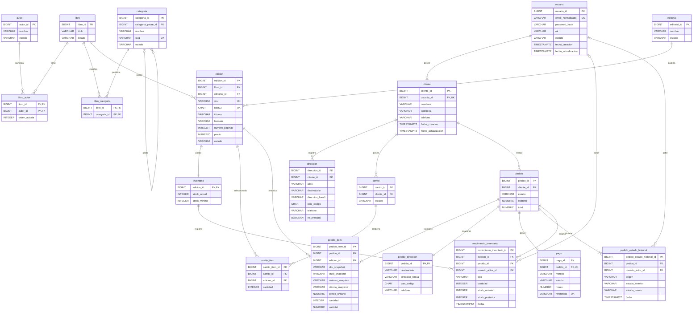

# PLIEGO — Modelo Físico PostgreSQL v1.0

**Documento:** MFP-PLIEGO-001  
**Versión:** 1.0  
**Estado:** BASELINE APROBADA  
**Fecha:** 2026-09-23  
**Proyecto:** PLIEGO  
**Tipo de documento:** Modelo físico relacional PostgreSQL  
**Motor objetivo:** PostgreSQL 18  
**Schema de aplicación:** `pliego`  
**Documentos fuente:**  
- `docs/requirements/use-case-baseline-v1.0.md` — versión interna 1.1, BASELINE APROBADA  
- `docs/domain/logical-erd-v1.0.md` — versión interna 1.1, BASELINE APROBADA  
- `docs/domain/data-dictionary-v1.0.md` — versión interna 1.1, BASELINE APROBADA  
- `docs/architecture/database-api-contract-v1.0.md` — versión 1.0, candidato a baseline  

**Ámbito:** Tablas, columnas, tipos, claves, constraints, índices, integridad física, triggers técnicos mínimos y decisiones necesarias para implementar posteriormente la Database API.  
**Siguiente artefacto:** Catálogo de Stored Procedures / Functions / Triggers v1.0 y Flyway Baseline.

---

# 1. Propósito

Este documento transforma el modelo lógico aprobado de PLIEGO en una especificación física concreta para PostgreSQL 18.

Su propósito es permitir que la implementación de la base de datos se realice sin reinterpretar:

- nombres físicos;
- tipos PostgreSQL;
- claves primarias;
- claves foráneas;
- nulabilidad;
- restricciones `CHECK`;
- claves únicas;
- índices parciales;
- índices de navegación;
- política `ON DELETE`;
- desnormalizaciones históricas justificadas;
- invariantes que pertenecen a constraints;
- invariantes que permanecen bajo Procedures;
- triggers técnicos mínimos;
- orden físico de creación mediante Flyway.

El modelo prioriza **Tercera Forma Normal (3FN)** para los datos operacionales.

Las únicas desnormalizaciones aceptadas siguen siendo las aprobadas previamente:

1. `pedido_item`, mediante snapshots históricos;
2. `pedido_direccion`, mediante snapshot de entrega.

No se introducen nuevas entidades de negocio.

---

# 2. Resultado de la auditoría previa

## 2.1 Estabilidad estructural

Los artefactos v1.1 son consistentes respecto a:

- 19 entidades persistentes;
- separación `Libro` ≠ `Edicion`;
- relaciones N:M mediante `libro_autor` y `libro_categoria`;
- inventario 1:1 por Edición;
- Carrito sin reserva de stock;
- snapshots de Pedido;
- máquina de estados de Pedido;
- máquina de estados de Pago;
- historial inmutable;
- cancelación con restauración;
- un único Pago por Pedido;
- ausencia de entidades fuera de alcance.

Por tanto, este modelo físico conserva exactamente esas 19 entidades.

## 2.2 Correcciones editoriales asumidas

Se asumen como corregidas para este modelo:

### DD — Idioma

```text
Edicion.Idioma
```

acepta:

- ISO 639-1: 2 letras;
- ISO 639-2/T: 3 letras cuando no exista ISO 639-1.

Físicamente:

```text
VARCHAR(3)
```

con representación canónica en minúsculas.

### DER — Estado

El DER v1.1 se considera:

```text
BASELINE APROBADA
```

aunque una frase heredada indique “candidato”.

---

# 3. Resolución de decisiones pendientes del DAC

Estas decisiones se fijan antes de crear tablas porque condicionan Procedures, constraints o índices posteriores.

## 3.1 Usuario `BLOCKED`

Regla física/contractual:

> Toda rutina privada de PLIEGO exige que el actor esté `ACTIVE`.

Un Usuario `BLOCKED` no puede:

- consultar perfil;
- consultar direcciones;
- consultar carrito;
- realizar checkout;
- consultar pedidos;
- cancelar pedidos.

Los Pedidos y demás datos no se eliminan.

Si un Pedido requiere intervención mientras el Cliente está bloqueado, un `ADMIN` puede operar mediante las rutinas administrativas.

Esto mantiene una regla única y evita excepciones por endpoint.

### Concurrencia con bloqueo de cuenta

El estado del actor se valida al inicio de la rutina.

Si el Usuario es bloqueado de forma concurrente después de dicha validación, la operación ya iniciada puede terminar normalmente.

El bloqueo aplica a nuevas invocaciones posteriores.

No se introducen locks adicionales sobre `usuario` exclusivamente para impedir esta carrera.

---

## 3.2 Búsquedas y valores inexistentes

### Categoría pública inexistente

En `fn_catalog_search`:

```text
p_category_slug desconocido
```

produce:

```text
0 filas
```

No es error de dominio.

### Identificador específico inexistente

Cuando una consulta es por ID de recurso concreto, se aplica la semántica definida en el Database API Contract.

### Códigos cerrados inválidos

Valores inválidos para:

- estado;
- formato;
- idioma sintácticamente inválido;
- método;
- tipo de movimiento;
- sort;

producen:

```text
P1001 INVALID_ARGUMENT
```

---

## 3.3 Orden determinista de consultas

Toda consulta paginada posee criterio estable.

### Catálogo público

Según `p_sort`:

```text
TITLE_ASC:
    lower(libro.titulo) ASC,
    edicion.edicion_id ASC

PRICE_ASC:
    edicion.precio ASC,
    edicion.edicion_id ASC

PRICE_DESC:
    edicion.precio DESC,
    edicion.edicion_id ASC
```

El REST Contract deberá suministrar `TITLE_ASC` cuando el consumidor no especifique sort.

### Búsquedas administrativas

Por defecto:

```text
fecha_creacion DESC,
id DESC
```

cuando exista `fecha_creacion`.

En entidades sin necesidad temporal particular, se utilizará:

```text
id DESC
```

### Inventario

```text
lower(libro.titulo) ASC,
edicion.edicion_id ASC
```

### Movimientos

```text
fecha DESC,
movimiento_inventario_id DESC
```

### Pedidos

```text
fecha_creacion DESC,
pedido_id DESC
```

---

## 3.4 Dinero en Java

Toda representación monetaria Java debe utilizar:

```text
java.math.BigDecimal
```

Queda prohibido para dinero:

```text
float
double
Float
Double
```

---

## 3.5 Referencia del Pago simulado

Cuando el pago simulado sea `APPROVED`, PostgreSQL genera:

```text
SIM-<UUIDv4>
```

usando la generación UUID disponible en PostgreSQL 18.

Ejemplo:

```text
SIM-a0eebc99-9c0b-4ef8-bb6d-6bb9bd380a11
```

Se almacena como `VARCHAR(100)` para no acoplar el modelo futuro a referencias UUID.

En `REJECTED`:

```text
referencia = NULL
```

y el motivo académico se registra en `detalle_resultado`.

Exigido por `ck_pago_referencia_estado` (decisión física v1, compatible con el carácter opcional del Diccionario).

En `REFUNDED` se conserva la referencia original.

---

# 4. Principios físicos de diseño

## 4.1 Normalización

Los datos maestros y operacionales se mantienen en 3FN.

No se duplican como fuente de verdad:

- stock en `edicion`;
- nombre de editorial en `edicion`;
- autores como texto en `libro`;
- categoría directa en `libro`;
- estado de pago en `pedido`;
- dirección activa en `cliente`;
- precio congelado en `carrito_item`.

## 4.2 Snapshots

Las columnas snapshot de `pedido_item` y `pedido_direccion` son desnormalizaciones intencionales porque representan hechos históricos.

No deben sincronizarse con tablas maestras.

## 4.3 Identificadores

Para entidades principales se utiliza:

```sql
BIGINT GENERATED ALWAYS AS IDENTITY
```

Justificación:

- simple;
- eficiente;
- apropiado para proyecto académico;
- sin significado de negocio;
- evita introducir UUID en todas las FKs;
- PostgreSQL administra la secuencia implícita.

Las asociaciones puras usan PK compuesta.

Las relaciones 1:1 dependientes pueden usar PK compartida.

## 4.4 Dinero

Persistencia monetaria:

```sql
NUMERIC
```

Nunca tipos de coma flotante.

`NUMERIC(30,2)` en agregados (`pedido_item.subtotal`, `pedido.subtotal/total`, `pago.monto`) es capacidad técnica —cubre cualquier producto de precio máximo × cantidad `INTEGER`—, no regla comercial ni límite de cantidad por compra.

## 4.5 Fechas

### Instantes

```sql
TIMESTAMPTZ
```

### Fechas civiles editoriales

```sql
DATE
```

## 4.6 Estados y códigos

No se utilizarán PostgreSQL `ENUM` en v1.

Se utilizará:

```text
VARCHAR + CHECK
```

Justificación:

- cambios controlados con Flyway más sencillos;
- menor acoplamiento de JDBC a tipos personalizados;
- dominio visible en el DDL;
- suficiente para conjuntos pequeños y estables.

## 4.7 Extensiones

PLIEGO v1 no requiere extensiones PostgreSQL.

En particular:

- no `citext`;
- no `pg_trgm`;
- no `uuid-ossp`;
- no `pgcrypto` como dependencia.

PostgreSQL 18 proporciona generación UUID en core para la referencia simulada.

---

# 5. Convenciones físicas

## 5.1 Naming

Todos los objetos utilizan:

```text
snake_case
```

## 5.2 Tablas

Singular:

```text
usuario
cliente
libro
edicion
pedido
```

## 5.3 Constraints

```text
pk_<tabla>
fk_<tabla>_<referencia>
uq_<tabla>_<concepto>
ck_<tabla>_<concepto>
```

## 5.4 Índices

```text
idx_<tabla>_<columnas/concepto>
uqx_<tabla>_<concepto>
```

`uqx_` se reserva para índices únicos parciales que no pueden declararse como `UNIQUE CONSTRAINT`.

## 5.5 Triggers

```text
trg_<tabla>_<evento>
```

## 5.6 Functions internas

```text
fn_<accion>
```

## 5.7 Procedures públicas

```text
sp_<dominio>_<accion>
```

---

# 6. Schema PostgreSQL

Todos los objetos del dominio se crean dentro de:

```sql
CREATE SCHEMA pliego;
```

No se distribuyen las tablas entre múltiples schemas en v1.

La aplicación utilizará nombres cualificados:

```text
pliego.usuario
pliego.libro
pliego.sp_checkout(...)
```

Esto evita depender implícitamente de `search_path`.

---

# 7. Mapeo de dominios lógicos a PostgreSQL

| Dominio lógico | Tipo físico |
|---|---|
| Id | `BIGINT` |
| Identidad generada | `BIGINT GENERATED ALWAYS AS IDENTITY` |
| Texto corto | `VARCHAR(n)` |
| Texto largo limitado | `VARCHAR(n)` |
| Texto narrativo limitado | `VARCHAR(n)` |
| Email | `VARCHAR(254)` |
| SKU | `VARCHAR(64)` |
| ISBN13 | `CHAR(13)` |
| LanguageCode | `VARCHAR(3)` |
| CountryCode | `CHAR(2)` |
| Phone | `VARCHAR(20)` |
| Estado/código | `VARCHAR(32)` o menor |
| Cantidad/stock | `INTEGER` |
| Money unitario | `NUMERIC(11,2)` |
| Money agregado | `NUMERIC(30,2)` (capacidad técnica, no regla comercial) |
| Boolean | `BOOLEAN` |
| Fecha civil | `DATE` |
| Instante | `TIMESTAMPTZ` |
| URL | `VARCHAR(2048)` |

---

# 8. Modelo físico — Identity / Customer

## 8.1 `pliego.usuario`

```sql
CREATE TABLE pliego.usuario (
    usuario_id          BIGINT GENERATED ALWAYS AS IDENTITY,
    email_normalizado   VARCHAR(254) NOT NULL,
    password_hash       VARCHAR(255) NOT NULL,
    rol                 VARCHAR(16)  NOT NULL,
    estado              VARCHAR(16)  NOT NULL DEFAULT 'ACTIVE',
    fecha_creacion      TIMESTAMPTZ  NOT NULL DEFAULT CURRENT_TIMESTAMP,
    fecha_actualizacion TIMESTAMPTZ  NOT NULL DEFAULT CURRENT_TIMESTAMP,

    CONSTRAINT pk_usuario
        PRIMARY KEY (usuario_id),

    CONSTRAINT uq_usuario_email
        UNIQUE (email_normalizado),

    CONSTRAINT ck_usuario_email_canonico
        CHECK (
            email_normalizado = lower(btrim(email_normalizado))
            AND char_length(email_normalizado) BETWEEN 3 AND 254
        ),

    CONSTRAINT ck_usuario_password_hash
        CHECK (char_length(btrim(password_hash)) > 0),

    CONSTRAINT ck_usuario_rol
        CHECK (rol IN ('CUSTOMER', 'ADMIN')),

    CONSTRAINT ck_usuario_estado
        CHECK (estado IN ('ACTIVE', 'BLOCKED'))
);
```

### 3FN

`usuario` contiene únicamente identidad/autenticación.

Los datos comerciales del CUSTOMER permanecen en `cliente`.

---

## 8.2 `pliego.cliente`

```sql
CREATE TABLE pliego.cliente (
    cliente_id          BIGINT GENERATED ALWAYS AS IDENTITY,
    usuario_id          BIGINT       NOT NULL,
    nombres             VARCHAR(120) NOT NULL,
    apellidos            VARCHAR(120) NOT NULL,
    telefono             VARCHAR(20),
    fecha_creacion       TIMESTAMPTZ  NOT NULL DEFAULT CURRENT_TIMESTAMP,
    fecha_actualizacion  TIMESTAMPTZ  NOT NULL DEFAULT CURRENT_TIMESTAMP,

    CONSTRAINT pk_cliente
        PRIMARY KEY (cliente_id),

    CONSTRAINT uq_cliente_usuario
        UNIQUE (usuario_id),

    CONSTRAINT fk_cliente_usuario
        FOREIGN KEY (usuario_id)
        REFERENCES pliego.usuario(usuario_id)
        ON DELETE RESTRICT,

    CONSTRAINT ck_cliente_nombres
        CHECK (char_length(btrim(nombres)) BETWEEN 1 AND 120),

    CONSTRAINT ck_cliente_apellidos
        CHECK (char_length(btrim(apellidos)) BETWEEN 1 AND 120),

    CONSTRAINT ck_cliente_telefono
        CHECK (
            telefono IS NULL
            OR telefono ~ '^\+?[0-9]{7,19}$'
        )
);
```

Regla cross-table:

```text
usuario.rol = CUSTOMER
```

se valida en las Procedures de registro/gestión.

---

## 8.3 `pliego.direccion`

```sql
CREATE TABLE pliego.direccion (
    direccion_id        BIGINT GENERATED ALWAYS AS IDENTITY,
    cliente_id          BIGINT       NOT NULL,
    alias               VARCHAR(80)  NOT NULL,
    destinatario        VARCHAR(200) NOT NULL,
    direccion_linea1    VARCHAR(200) NOT NULL,
    direccion_linea2    VARCHAR(200),
    ciudad              VARCHAR(100) NOT NULL,
    provincia           VARCHAR(100) NOT NULL,
    pais_codigo         CHAR(2)      NOT NULL,
    codigo_postal       VARCHAR(20),
    referencia          VARCHAR(300),
    telefono            VARCHAR(20)  NOT NULL,
    es_principal        BOOLEAN      NOT NULL DEFAULT FALSE,
    fecha_creacion      TIMESTAMPTZ  NOT NULL DEFAULT CURRENT_TIMESTAMP,
    fecha_actualizacion TIMESTAMPTZ  NOT NULL DEFAULT CURRENT_TIMESTAMP,

    CONSTRAINT pk_direccion
        PRIMARY KEY (direccion_id),

    CONSTRAINT fk_direccion_cliente
        FOREIGN KEY (cliente_id)
        REFERENCES pliego.cliente(cliente_id)
        ON DELETE RESTRICT,

    CONSTRAINT ck_direccion_alias
        CHECK (char_length(btrim(alias)) BETWEEN 1 AND 80),

    CONSTRAINT ck_direccion_destinatario
        CHECK (char_length(btrim(destinatario)) BETWEEN 1 AND 200),

    CONSTRAINT ck_direccion_linea1
        CHECK (char_length(btrim(direccion_linea1)) BETWEEN 1 AND 200),

    CONSTRAINT ck_direccion_ciudad
        CHECK (char_length(btrim(ciudad)) BETWEEN 1 AND 100),

    CONSTRAINT ck_direccion_provincia
        CHECK (char_length(btrim(provincia)) BETWEEN 1 AND 100),

    CONSTRAINT ck_direccion_pais_formato
        CHECK (
            pais_codigo ~ '^[A-Z]{2}$'
            AND pliego.fn_is_valid_country_code(pais_codigo)
        ),

    CONSTRAINT ck_direccion_telefono
        CHECK (telefono ~ '^\+?[0-9]{7,19}$')
);
```

### País

Además del formato, `ck_direccion_pais_formato` consume `pliego.fn_is_valid_country_code` (§24) como whitelist cerrada ISO 3166-1 alpha-2.

No se crea tabla `pais` porque:

- no es una entidad del dominio PLIEGO;
- no existe caso de uso para administrarla;
- introducirla ampliaría innecesariamente el DER.

### Dirección principal única

```sql
CREATE UNIQUE INDEX uqx_direccion_cliente_principal
    ON pliego.direccion (cliente_id)
    WHERE es_principal;
```

### Navegación

```sql
CREATE INDEX idx_direccion_cliente
    ON pliego.direccion (cliente_id);
```

---

# 9. Modelo físico — Catalog

## 9.1 `pliego.autor`

```sql
CREATE TABLE pliego.autor (
    autor_id            BIGINT GENERATED ALWAYS AS IDENTITY,
    nombre              VARCHAR(200) NOT NULL,
    biografia           VARCHAR(5000),
    estado              VARCHAR(16)  NOT NULL DEFAULT 'ACTIVE',
    fecha_creacion      TIMESTAMPTZ  NOT NULL DEFAULT CURRENT_TIMESTAMP,
    fecha_actualizacion TIMESTAMPTZ  NOT NULL DEFAULT CURRENT_TIMESTAMP,

    CONSTRAINT pk_autor
        PRIMARY KEY (autor_id),

    CONSTRAINT ck_autor_nombre
        CHECK (char_length(btrim(nombre)) BETWEEN 1 AND 200),

    CONSTRAINT ck_autor_estado
        CHECK (estado IN ('ACTIVE', 'INACTIVE'))
);
```

`nombre` no es único.

---

## 9.2 `pliego.editorial`

```sql
CREATE TABLE pliego.editorial (
    editorial_id        BIGINT GENERATED ALWAYS AS IDENTITY,
    nombre              VARCHAR(200) NOT NULL,
    descripcion         VARCHAR(2000),
    estado              VARCHAR(16) NOT NULL DEFAULT 'ACTIVE',
    fecha_creacion      TIMESTAMPTZ NOT NULL DEFAULT CURRENT_TIMESTAMP,
    fecha_actualizacion TIMESTAMPTZ NOT NULL DEFAULT CURRENT_TIMESTAMP,

    CONSTRAINT pk_editorial
        PRIMARY KEY (editorial_id),

    CONSTRAINT ck_editorial_nombre
        CHECK (char_length(btrim(nombre)) BETWEEN 1 AND 200),

    CONSTRAINT ck_editorial_estado
        CHECK (estado IN ('ACTIVE', 'INACTIVE'))
);
```

`nombre` no es único.

---

## 9.3 `pliego.categoria`

```sql
CREATE TABLE pliego.categoria (
    categoria_id        BIGINT GENERATED ALWAYS AS IDENTITY,
    categoria_padre_id  BIGINT,
    nombre              VARCHAR(120) NOT NULL,
    slug                VARCHAR(140) NOT NULL,
    descripcion         VARCHAR(1000),
    estado              VARCHAR(16)  NOT NULL DEFAULT 'ACTIVE',
    fecha_creacion      TIMESTAMPTZ  NOT NULL DEFAULT CURRENT_TIMESTAMP,
    fecha_actualizacion TIMESTAMPTZ  NOT NULL DEFAULT CURRENT_TIMESTAMP,

    CONSTRAINT pk_categoria
        PRIMARY KEY (categoria_id),

    CONSTRAINT uq_categoria_slug
        UNIQUE (slug),

    CONSTRAINT fk_categoria_padre
        FOREIGN KEY (categoria_padre_id)
        REFERENCES pliego.categoria(categoria_id)
        ON DELETE RESTRICT,

    CONSTRAINT ck_categoria_nombre
        CHECK (char_length(btrim(nombre)) BETWEEN 1 AND 120),

    CONSTRAINT ck_categoria_slug
        CHECK (
            char_length(slug) BETWEEN 1 AND 140
            AND slug = lower(btrim(slug))
            AND slug ~ '^[a-z0-9]+(-[a-z0-9]+)*$'
        ),

    CONSTRAINT ck_categoria_estado
        CHECK (estado IN ('ACTIVE', 'INACTIVE')),

    CONSTRAINT ck_categoria_no_self_parent
        CHECK (
            categoria_padre_id IS NULL
            OR categoria_padre_id <> categoria_id
        )
);
```

### Profundidad máxima y ciclos

No pueden garantizarse completamente mediante `CHECK` porque dependen de otras filas.

Se protegen mediante:

- `sp_category_create`;
- `sp_category_update`;
- trigger defensivo mínimo `trg_categoria_validate_hierarchy`.

El trigger rechazará:

- padre que ya sea subcategoría;
- ciclos;
- autoreferencia.

### Índice

```sql
CREATE INDEX idx_categoria_padre
    ON pliego.categoria (categoria_padre_id)
    WHERE categoria_padre_id IS NOT NULL;
```

---

## 9.4 `pliego.libro`

```sql
CREATE TABLE pliego.libro (
    libro_id            BIGINT GENERATED ALWAYS AS IDENTITY,
    titulo              VARCHAR(300) NOT NULL,
    subtitulo           VARCHAR(300),
    sinopsis            VARCHAR(10000),
    estado              VARCHAR(16) NOT NULL DEFAULT 'ACTIVE',
    fecha_creacion      TIMESTAMPTZ NOT NULL DEFAULT CURRENT_TIMESTAMP,
    fecha_actualizacion TIMESTAMPTZ NOT NULL DEFAULT CURRENT_TIMESTAMP,

    CONSTRAINT pk_libro
        PRIMARY KEY (libro_id),

    CONSTRAINT ck_libro_titulo
        CHECK (char_length(btrim(titulo)) BETWEEN 1 AND 300),

    CONSTRAINT ck_libro_estado
        CHECK (estado IN ('ACTIVE', 'INACTIVE'))
);
```

No se duplica:

- autor;
- editorial;
- categoría;
- precio;
- stock.

---

## 9.5 `pliego.libro_autor`

```sql
CREATE TABLE pliego.libro_autor (
    libro_id      BIGINT  NOT NULL,
    autor_id      BIGINT  NOT NULL,
    orden_autoria INTEGER NOT NULL,

    CONSTRAINT pk_libro_autor
        PRIMARY KEY (libro_id, autor_id),

    CONSTRAINT fk_libro_autor_libro
        FOREIGN KEY (libro_id)
        REFERENCES pliego.libro(libro_id)
        ON DELETE RESTRICT,

    CONSTRAINT fk_libro_autor_autor
        FOREIGN KEY (autor_id)
        REFERENCES pliego.autor(autor_id)
        ON DELETE RESTRICT,

    CONSTRAINT ck_libro_autor_orden
        CHECK (orden_autoria > 0),

    CONSTRAINT uq_libro_autor_orden
        UNIQUE (libro_id, orden_autoria)
        DEFERRABLE INITIALLY IMMEDIATE
);
```

### Motivo de constraint diferible

`sp_book_update` podrá reordenar autores dentro de una misma transacción sin violaciones transitorias de `orden_autoria`.

### Índice inverso

```sql
CREATE INDEX idx_libro_autor_autor
    ON pliego.libro_autor (autor_id, libro_id);
```

---

## 9.6 `pliego.libro_categoria`

```sql
CREATE TABLE pliego.libro_categoria (
    libro_id     BIGINT NOT NULL,
    categoria_id BIGINT NOT NULL,

    CONSTRAINT pk_libro_categoria
        PRIMARY KEY (libro_id, categoria_id),

    CONSTRAINT fk_libro_categoria_libro
        FOREIGN KEY (libro_id)
        REFERENCES pliego.libro(libro_id)
        ON DELETE RESTRICT,

    CONSTRAINT fk_libro_categoria_categoria
        FOREIGN KEY (categoria_id)
        REFERENCES pliego.categoria(categoria_id)
        ON DELETE RESTRICT
);
```

Índice para filtrar catálogo por categoría:

```sql
CREATE INDEX idx_libro_categoria_categoria
    ON pliego.libro_categoria (categoria_id, libro_id);
```

---

## 9.7 `pliego.edicion`

```sql
CREATE TABLE pliego.edicion (
    edicion_id            BIGINT GENERATED ALWAYS AS IDENTITY,
    libro_id              BIGINT        NOT NULL,
    editorial_id          BIGINT        NOT NULL,
    sku                   VARCHAR(64)   NOT NULL,
    isbn13                CHAR(13),
    idioma                VARCHAR(3)    NOT NULL,
    formato               VARCHAR(16)   NOT NULL,
    numero_paginas        INTEGER       NOT NULL,
    fecha_publicacion     DATE,
    precio                NUMERIC(11,2) NOT NULL,
    portada_url           VARCHAR(2048),
    portada_licencia      VARCHAR(32),
    portada_fuente_url    VARCHAR(2048),
    portada_atribucion    VARCHAR(500),
    estado                VARCHAR(16)   NOT NULL DEFAULT 'ACTIVE',
    fecha_creacion        TIMESTAMPTZ   NOT NULL DEFAULT CURRENT_TIMESTAMP,
    fecha_actualizacion   TIMESTAMPTZ   NOT NULL DEFAULT CURRENT_TIMESTAMP,

    CONSTRAINT pk_edicion
        PRIMARY KEY (edicion_id),

    CONSTRAINT uq_edicion_sku
        UNIQUE (sku),

    CONSTRAINT uq_edicion_isbn
        UNIQUE (isbn13),

    CONSTRAINT fk_edicion_libro
        FOREIGN KEY (libro_id)
        REFERENCES pliego.libro(libro_id)
        ON DELETE RESTRICT,

    CONSTRAINT fk_edicion_editorial
        FOREIGN KEY (editorial_id)
        REFERENCES pliego.editorial(editorial_id)
        ON DELETE RESTRICT,

    CONSTRAINT ck_edicion_sku
        CHECK (
            sku = upper(btrim(sku))
            AND char_length(sku) BETWEEN 1 AND 64
            AND sku ~ '^[A-Z0-9][A-Z0-9._-]{0,63}$'
        ),

    CONSTRAINT ck_edicion_isbn_formato
        CHECK (
            isbn13 IS NULL
            OR isbn13 ~ '^[0-9]{13}$'
        ),

    CONSTRAINT ck_edicion_idioma
        CHECK (
            idioma = lower(idioma)
            AND idioma ~ '^[a-z]{2,3}$'
        ),

    CONSTRAINT ck_edicion_formato
        CHECK (formato IN ('PAPERBACK', 'HARDCOVER')),

    CONSTRAINT ck_edicion_paginas
        CHECK (numero_paginas BETWEEN 1 AND 100000),

    CONSTRAINT ck_edicion_precio
        CHECK (
            precio > 0
            AND precio <= 999999999.99
        ),

    CONSTRAINT ck_edicion_estado
        CHECK (estado IN ('ACTIVE', 'INACTIVE')),

    CONSTRAINT ck_edicion_portada_licencia
        CHECK (
            portada_licencia IS NULL
            OR portada_licencia IN (
                'PUBLIC_DOMAIN',
                'CC0',
                'CC_BY',
                'CC_BY_SA',
                'OWNED'
            )
        ),

    CONSTRAINT ck_edicion_portada_coherencia
        CHECK (
            (
                portada_url IS NULL
                AND portada_licencia IS NULL
                AND portada_fuente_url IS NULL
                AND portada_atribucion IS NULL
            )
            OR
            (
                portada_url IS NOT NULL
                AND portada_licencia IS NOT NULL
                AND portada_fuente_url IS NOT NULL
                AND (
                    portada_licencia NOT IN ('CC_BY', 'CC_BY_SA')
                    OR (
                        portada_atribucion IS NOT NULL
                        AND char_length(btrim(portada_atribucion)) > 0
                    )
                )
            )
        )
);
```

### ISBN checksum

`ck_edicion_isbn_formato` protege forma.

El checksum ISBN-13 se valida en PostgreSQL mediante helper interno puro utilizado por:

- `sp_edition_create`;
- `sp_edition_update`.

No se delega a Java como autoridad.

### Índices

```sql
CREATE INDEX idx_edicion_libro
    ON pliego.edicion (libro_id, edicion_id);

CREATE INDEX idx_edicion_editorial
    ON pliego.edicion (editorial_id, edicion_id);

CREATE INDEX idx_edicion_catalogo_filtros
    ON pliego.edicion (estado, idioma, formato, precio, edicion_id);
```

No se añade búsqueda trigram/full-text en v1.

---

# 10. Modelo físico — Inventory

## 10.1 `pliego.inventario`

Se utiliza PK compartida para expresar físicamente el 1:1.

```sql
CREATE TABLE pliego.inventario (
    edicion_id          BIGINT      NOT NULL,
    stock_actual        INTEGER     NOT NULL DEFAULT 0,
    stock_minimo        INTEGER     NOT NULL DEFAULT 0,
    fecha_actualizacion TIMESTAMPTZ NOT NULL DEFAULT CURRENT_TIMESTAMP,

    CONSTRAINT pk_inventario
        PRIMARY KEY (edicion_id),

    CONSTRAINT fk_inventario_edicion
        FOREIGN KEY (edicion_id)
        REFERENCES pliego.edicion(edicion_id)
        ON DELETE RESTRICT,

    CONSTRAINT ck_inventario_stock_actual
        CHECK (stock_actual >= 0),

    CONSTRAINT ck_inventario_stock_minimo
        CHECK (stock_minimo >= 0)
);
```

No se almacena `bajo_stock`.

Se deriva:

```text
stock_minimo > 0
AND stock_actual <= stock_minimo
```

---

## 10.2 `pliego.movimiento_inventario`

```sql
CREATE TABLE pliego.movimiento_inventario (
    movimiento_inventario_id BIGINT GENERATED ALWAYS AS IDENTITY,
    edicion_id                BIGINT       NOT NULL,
    pedido_id                 BIGINT,
    usuario_actor_id          BIGINT,
    tipo                      VARCHAR(24)  NOT NULL,
    cantidad                  INTEGER      NOT NULL,
    stock_anterior            INTEGER      NOT NULL,
    stock_posterior           INTEGER      NOT NULL,
    motivo                    VARCHAR(500),
    fecha                     TIMESTAMPTZ  NOT NULL DEFAULT CURRENT_TIMESTAMP,

    CONSTRAINT pk_movimiento_inventario
        PRIMARY KEY (movimiento_inventario_id),

    CONSTRAINT fk_movimiento_inventario_edicion
        FOREIGN KEY (edicion_id)
        REFERENCES pliego.inventario(edicion_id)
        ON DELETE RESTRICT,

    CONSTRAINT fk_movimiento_inventario_pedido
        FOREIGN KEY (pedido_id)
        REFERENCES pliego.pedido(pedido_id)
        ON DELETE RESTRICT,

    CONSTRAINT fk_movimiento_inventario_usuario
        FOREIGN KEY (usuario_actor_id)
        REFERENCES pliego.usuario(usuario_id)
        ON DELETE RESTRICT,

    CONSTRAINT ck_movimiento_inventario_tipo
        CHECK (
            tipo IN (
                'ENTRY',
                'ADJUSTMENT_IN',
                'ADJUSTMENT_OUT',
                'SALE',
                'CANCELLATION'
            )
        ),

    CONSTRAINT ck_movimiento_inventario_cantidad
        CHECK (cantidad > 0),

    CONSTRAINT ck_movimiento_inventario_stocks
        CHECK (
            stock_anterior >= 0
            AND stock_posterior >= 0
        ),

    CONSTRAINT ck_movimiento_inventario_contexto
        CHECK (
            (
                tipo IN ('ENTRY', 'ADJUSTMENT_IN', 'ADJUSTMENT_OUT')
                AND pedido_id IS NULL
                AND usuario_actor_id IS NOT NULL
                AND motivo IS NOT NULL
                AND char_length(btrim(motivo)) > 0
            )
            OR
            (
                tipo IN ('SALE', 'CANCELLATION')
                AND pedido_id IS NOT NULL
                AND usuario_actor_id IS NULL
            )
        ),

    CONSTRAINT ck_movimiento_inventario_aritmetica
        CHECK (
            (
                tipo IN ('ENTRY', 'ADJUSTMENT_IN', 'CANCELLATION')
                AND stock_posterior = stock_anterior + cantidad
            )
            OR
            (
                tipo IN ('ADJUSTMENT_OUT', 'SALE')
                AND stock_posterior = stock_anterior - cantidad
            )
        )
);
```

### Nota de orden de creación

`movimiento_inventario` referencia `pedido`.

Por tanto, físicamente:

- se puede crear después de `pedido`; o
- crear inicialmente sin dicha FK y añadirla posteriormente.

La estrategia Flyway seleccionada más abajo evita dependencias circulares.

### Unicidad SALE/CANCELLATION

```sql
CREATE UNIQUE INDEX uqx_movimiento_pedido_edicion_tipo
    ON pliego.movimiento_inventario (pedido_id, edicion_id, tipo)
    WHERE tipo IN ('SALE', 'CANCELLATION');
```

### Navegación

```sql
CREATE INDEX idx_movimiento_edicion_fecha
    ON pliego.movimiento_inventario
       (edicion_id, fecha DESC, movimiento_inventario_id DESC);

CREATE INDEX idx_movimiento_pedido
    ON pliego.movimiento_inventario (pedido_id)
    WHERE pedido_id IS NOT NULL;
```

`CANCELLATION` requiere `SALE` previo.

Eso permanece bajo `sp_order_cancel`; no es expresable mediante un `CHECK` de la misma fila.

---

# 11. Modelo físico — Cart

## 11.1 `pliego.carrito`

```sql
CREATE TABLE pliego.carrito (
    carrito_id          BIGINT GENERATED ALWAYS AS IDENTITY,
    cliente_id          BIGINT      NOT NULL,
    estado              VARCHAR(16) NOT NULL DEFAULT 'ACTIVE',
    fecha_creacion      TIMESTAMPTZ NOT NULL DEFAULT CURRENT_TIMESTAMP,
    fecha_actualizacion TIMESTAMPTZ NOT NULL DEFAULT CURRENT_TIMESTAMP,

    CONSTRAINT pk_carrito
        PRIMARY KEY (carrito_id),

    CONSTRAINT fk_carrito_cliente
        FOREIGN KEY (cliente_id)
        REFERENCES pliego.cliente(cliente_id)
        ON DELETE RESTRICT,

    CONSTRAINT ck_carrito_estado
        CHECK (estado IN ('ACTIVE', 'CHECKED_OUT'))
);
```

### Único ACTIVE por Cliente

```sql
CREATE UNIQUE INDEX uqx_carrito_cliente_active
    ON pliego.carrito (cliente_id)
    WHERE estado = 'ACTIVE';
```

### Historial por Cliente

```sql
CREATE INDEX idx_carrito_cliente_fecha
    ON pliego.carrito
       (cliente_id, fecha_creacion DESC, carrito_id DESC);
```

---

## 11.2 `pliego.carrito_item`

```sql
CREATE TABLE pliego.carrito_item (
    carrito_item_id     BIGINT GENERATED ALWAYS AS IDENTITY,
    carrito_id          BIGINT      NOT NULL,
    edicion_id          BIGINT      NOT NULL,
    cantidad            INTEGER     NOT NULL,
    fecha_creacion      TIMESTAMPTZ NOT NULL DEFAULT CURRENT_TIMESTAMP,
    fecha_actualizacion TIMESTAMPTZ NOT NULL DEFAULT CURRENT_TIMESTAMP,

    CONSTRAINT pk_carrito_item
        PRIMARY KEY (carrito_item_id),

    CONSTRAINT fk_carrito_item_carrito
        FOREIGN KEY (carrito_id)
        REFERENCES pliego.carrito(carrito_id)
        ON DELETE RESTRICT,

    CONSTRAINT fk_carrito_item_edicion
        FOREIGN KEY (edicion_id)
        REFERENCES pliego.edicion(edicion_id)
        ON DELETE RESTRICT,

    CONSTRAINT uq_carrito_item_edicion
        UNIQUE (carrito_id, edicion_id),

    CONSTRAINT ck_carrito_item_cantidad
        CHECK (cantidad > 0)
);
```

Índice inverso:

```sql
CREATE INDEX idx_carrito_item_edicion
    ON pliego.carrito_item (edicion_id, carrito_id);
```

La regla:

```text
cantidad <= stock_actual
```

se revalida por Procedures.

No es una invariante permanente debido a que el carrito no reserva inventario.

---

# 12. Modelo físico — Sales / Payment

## 12.1 `pliego.pedido`

```sql
CREATE TABLE pliego.pedido (
    pedido_id           BIGINT GENERATED ALWAYS AS IDENTITY,
    cliente_id          BIGINT        NOT NULL,
    estado              VARCHAR(32)   NOT NULL,
    subtotal            NUMERIC(30,2) NOT NULL,
    total               NUMERIC(30,2) NOT NULL,
    fecha_creacion      TIMESTAMPTZ   NOT NULL DEFAULT CURRENT_TIMESTAMP,
    fecha_actualizacion TIMESTAMPTZ   NOT NULL DEFAULT CURRENT_TIMESTAMP,

    CONSTRAINT pk_pedido
        PRIMARY KEY (pedido_id),

    CONSTRAINT fk_pedido_cliente
        FOREIGN KEY (cliente_id)
        REFERENCES pliego.cliente(cliente_id)
        ON DELETE RESTRICT,

    CONSTRAINT ck_pedido_estado
        CHECK (
            estado IN (
                'PENDING_PAYMENT',
                'CONFIRMED',
                'PREPARING',
                'SHIPPED',
                'DELIVERED',
                'CANCELLED'
            )
        ),

    CONSTRAINT ck_pedido_subtotal
        CHECK (subtotal > 0),

    CONSTRAINT ck_pedido_total
        CHECK (total > 0),

    CONSTRAINT ck_pedido_total_v1
        CHECK (total = subtotal)
);
```

### Índices

```sql
CREATE INDEX idx_pedido_cliente_fecha
    ON pliego.pedido
       (cliente_id, fecha_creacion DESC, pedido_id DESC);

CREATE INDEX idx_pedido_estado_fecha
    ON pliego.pedido
       (estado, fecha_creacion DESC, pedido_id DESC);

CREATE INDEX idx_pedido_fecha
    ON pliego.pedido
       (fecha_creacion DESC, pedido_id DESC);
```

---

## 12.2 `pliego.pedido_item`

```sql
CREATE TABLE pliego.pedido_item (
    pedido_item_id      BIGINT GENERATED ALWAYS AS IDENTITY,
    pedido_id           BIGINT        NOT NULL,
    edicion_id          BIGINT        NOT NULL,
    sku_snapshot        VARCHAR(64)   NOT NULL,
    isbn_snapshot       CHAR(13),
    titulo_snapshot     VARCHAR(300)  NOT NULL,
    autores_snapshot    VARCHAR(1000) NOT NULL,
    editorial_snapshot  VARCHAR(200)  NOT NULL,
    formato_snapshot    VARCHAR(16)   NOT NULL,
    idioma_snapshot     VARCHAR(3)    NOT NULL,
    precio_unitario     NUMERIC(11,2) NOT NULL,
    cantidad            INTEGER       NOT NULL,
    subtotal            NUMERIC(30,2) NOT NULL,

    CONSTRAINT pk_pedido_item
        PRIMARY KEY (pedido_item_id),

    CONSTRAINT fk_pedido_item_pedido
        FOREIGN KEY (pedido_id)
        REFERENCES pliego.pedido(pedido_id)
        ON DELETE RESTRICT,

    CONSTRAINT fk_pedido_item_edicion
        FOREIGN KEY (edicion_id)
        REFERENCES pliego.edicion(edicion_id)
        ON DELETE RESTRICT,

    CONSTRAINT uq_pedido_item_edicion
        UNIQUE (pedido_id, edicion_id),

    CONSTRAINT ck_pedido_item_isbn
        CHECK (
            isbn_snapshot IS NULL
            OR isbn_snapshot ~ '^[0-9]{13}$'
        ),

    CONSTRAINT ck_pedido_item_formato
        CHECK (formato_snapshot IN ('PAPERBACK', 'HARDCOVER')),

    CONSTRAINT ck_pedido_item_idioma
        CHECK (
            idioma_snapshot = lower(idioma_snapshot)
            AND idioma_snapshot ~ '^[a-z]{2,3}$'
        ),

    CONSTRAINT ck_pedido_item_precio
        CHECK (precio_unitario > 0),

    CONSTRAINT ck_pedido_item_cantidad
        CHECK (cantidad > 0),

    CONSTRAINT ck_pedido_item_subtotal
        CHECK (
            subtotal > 0
            AND subtotal = precio_unitario * cantidad
        )
);
```

### 3FN y snapshot

Los campos `*_snapshot` no representan una duplicación operativa.

Son evidencia histórica.

No deben actualizarse cuando cambie:

- Libro;
- Autor;
- Editorial;
- Edición.

### Índice inverso

```sql
CREATE INDEX idx_pedido_item_edicion
    ON pliego.pedido_item (edicion_id, pedido_id);
```

---

## 12.3 `pliego.pedido_direccion`

```sql
CREATE TABLE pliego.pedido_direccion (
    pedido_id          BIGINT       NOT NULL,
    destinatario       VARCHAR(200) NOT NULL,
    direccion_linea1   VARCHAR(200) NOT NULL,
    direccion_linea2   VARCHAR(200),
    ciudad             VARCHAR(100) NOT NULL,
    provincia          VARCHAR(100) NOT NULL,
    pais_codigo        CHAR(2)      NOT NULL,
    codigo_postal      VARCHAR(20),
    referencia         VARCHAR(300),
    telefono           VARCHAR(20)  NOT NULL,

    CONSTRAINT pk_pedido_direccion
        PRIMARY KEY (pedido_id),

    CONSTRAINT fk_pedido_direccion_pedido
        FOREIGN KEY (pedido_id)
        REFERENCES pliego.pedido(pedido_id)
        ON DELETE RESTRICT,

    CONSTRAINT ck_pedido_direccion_pais_formato
        CHECK (
            pais_codigo ~ '^[A-Z]{2}$'
            AND pliego.fn_is_valid_country_code(pais_codigo)
        ),

    CONSTRAINT ck_pedido_direccion_telefono
        CHECK (telefono ~ '^\+?[0-9]{7,19}$')
);
```

Se aplica el mismo helper `pliego.fn_is_valid_country_code` (§24).

No existe:

```text
direccion_id
alias
```

porque el snapshot debe ser independiente.

---

## 12.4 `pliego.pago`

```sql
CREATE TABLE pliego.pago (
    pago_id             BIGINT GENERATED ALWAYS AS IDENTITY,
    pedido_id           BIGINT        NOT NULL,
    metodo              VARCHAR(16)   NOT NULL,
    estado              VARCHAR(16)   NOT NULL,
    monto               NUMERIC(30,2) NOT NULL,
    referencia          VARCHAR(100),
    detalle_resultado   VARCHAR(500),
    fecha_creacion      TIMESTAMPTZ   NOT NULL DEFAULT CURRENT_TIMESTAMP,
    fecha_actualizacion TIMESTAMPTZ   NOT NULL DEFAULT CURRENT_TIMESTAMP,

    CONSTRAINT pk_pago
        PRIMARY KEY (pago_id),

    CONSTRAINT uq_pago_pedido
        UNIQUE (pedido_id),

    CONSTRAINT uq_pago_referencia
        UNIQUE (referencia),

    CONSTRAINT fk_pago_pedido
        FOREIGN KEY (pedido_id)
        REFERENCES pliego.pedido(pedido_id)
        ON DELETE RESTRICT,

    CONSTRAINT ck_pago_metodo
        CHECK (metodo IN ('CARD', 'TRANSFER')),

    CONSTRAINT ck_pago_estado
        CHECK (
            estado IN (
                'PENDING',
                'APPROVED',
                'REJECTED',
                'REFUNDED'
            )
        ),

    CONSTRAINT ck_pago_monto
        CHECK (monto > 0),

    CONSTRAINT ck_pago_referencia_estado
        CHECK (
            (estado = 'PENDING'  AND referencia IS NULL)
            OR
            (estado = 'APPROVED' AND referencia IS NOT NULL)
            OR
            (estado = 'REJECTED' AND referencia IS NULL)
            OR
            (estado = 'REFUNDED' AND referencia IS NOT NULL)
        )
);
```

### Reglas cross-table

Estas no son `CHECK` porque requieren leer `pedido`:

```text
Pago.Monto = Pedido.Total
Pedido/Pago status compatibility
```

Las preservan:

- `sp_checkout`;
- `sp_order_cancel`.

### Referencia

`uq_pago_referencia` permite múltiples `NULL` de forma natural en PostgreSQL y garantiza unicidad cuando existe.

---

## 12.5 `pliego.pedido_estado_historial`

```sql
CREATE TABLE pliego.pedido_estado_historial (
    pedido_estado_historial_id BIGINT GENERATED ALWAYS AS IDENTITY,
    pedido_id                  BIGINT      NOT NULL,
    usuario_actor_id           BIGINT,
    origen                     VARCHAR(16) NOT NULL,
    estado_anterior            VARCHAR(32),
    estado_nuevo               VARCHAR(32) NOT NULL,
    fecha                      TIMESTAMPTZ NOT NULL DEFAULT CURRENT_TIMESTAMP,

    CONSTRAINT pk_pedido_estado_historial
        PRIMARY KEY (pedido_estado_historial_id),

    CONSTRAINT fk_pedido_estado_historial_pedido
        FOREIGN KEY (pedido_id)
        REFERENCES pliego.pedido(pedido_id)
        ON DELETE RESTRICT,

    CONSTRAINT fk_pedido_estado_historial_usuario
        FOREIGN KEY (usuario_actor_id)
        REFERENCES pliego.usuario(usuario_id)
        ON DELETE RESTRICT,

    CONSTRAINT ck_pedido_historial_origen
        CHECK (origen IN ('USER', 'SYSTEM')),

    CONSTRAINT ck_pedido_historial_estado_anterior
        CHECK (
            estado_anterior IS NULL
            OR estado_anterior IN (
                'PENDING_PAYMENT',
                'CONFIRMED',
                'PREPARING',
                'SHIPPED',
                'DELIVERED',
                'CANCELLED'
            )
        ),

    CONSTRAINT ck_pedido_historial_estado_nuevo
        CHECK (
            estado_nuevo IN (
                'PENDING_PAYMENT',
                'CONFIRMED',
                'PREPARING',
                'SHIPPED',
                'DELIVERED',
                'CANCELLED'
            )
        ),

    CONSTRAINT ck_pedido_historial_actor
        CHECK (
            (origen = 'USER' AND usuario_actor_id IS NOT NULL)
            OR
            (origen = 'SYSTEM' AND usuario_actor_id IS NULL)
        ),

    CONSTRAINT ck_pedido_historial_inicial
        CHECK (
            estado_anterior IS NOT NULL
            OR (
                estado_nuevo = 'PENDING_PAYMENT'
                AND origen = 'SYSTEM'
                AND usuario_actor_id IS NULL
            )
        )
);
```

### Un solo registro inicial

```sql
CREATE UNIQUE INDEX uqx_pedido_historial_inicial
    ON pliego.pedido_estado_historial (pedido_id)
    WHERE estado_anterior IS NULL;
```

### Navegación

```sql
CREATE INDEX idx_pedido_historial_pedido_fecha
    ON pliego.pedido_estado_historial
       (pedido_id, fecha ASC, pedido_estado_historial_id ASC);
```

La continuidad completa:

```text
nuevo EstadoAnterior = anterior EstadoNuevo
```

permanece bajo Procedures.

---

# 13. Dependencia circular Pedido ↔ MovimientoInventario

Existe una relación lógica:

```text
Pedido
    └── MovimientoInventario
```

pero `movimiento_inventario` pertenece al módulo Inventario y necesita referenciar `pedido`.

Para mantener migraciones simples:

1. crear primero tablas de Identity/Customer/Catalog/Inventory base;
2. crear Carrito;
3. crear Pedido y dependencias;
4. crear `movimiento_inventario` al final; o
5. si se requiere antes, agregar `fk_movimiento_inventario_pedido` mediante `ALTER TABLE`.

La propuesta Flyway de este documento elige:

```text
movimiento_inventario después de pedido
```

para evitar DDL incompleto intermedio.

`inventario` sí puede existir antes de Pedido.

---

# 14. Diagrama físico consolidado



---

# 15. Índices físicos mínimos

Los PK y UNIQUE constraints ya generan índices B-tree y no deben duplicarse.

PostgreSQL no crea automáticamente índices sobre todas las columnas FK, por lo que se agregan solo los necesarios para navegación y joins frecuentes.

## 15.1 Identity / Customer

```text
uq_usuario_email                     UNIQUE
uq_cliente_usuario                   UNIQUE
idx_direccion_cliente
uqx_direccion_cliente_principal      UNIQUE PARTIAL
```

## 15.2 Catalog

```text
uq_categoria_slug
idx_categoria_padre

idx_libro_autor_autor
uq_libro_autor_orden                 UNIQUE DEFERRABLE

idx_libro_categoria_categoria

uq_edicion_sku
uq_edicion_isbn
idx_edicion_libro
idx_edicion_editorial
idx_edicion_catalogo_filtros
```

## 15.3 Inventory

```text
idx_movimiento_edicion_fecha
idx_movimiento_pedido
uqx_movimiento_pedido_edicion_tipo
```

## 15.4 Cart

```text
uqx_carrito_cliente_active
idx_carrito_cliente_fecha
uq_carrito_item_edicion
idx_carrito_item_edicion
```

## 15.5 Sales

```text
idx_pedido_cliente_fecha
idx_pedido_estado_fecha
idx_pedido_fecha

uq_pedido_item_edicion
idx_pedido_item_edicion

uq_pago_pedido
uq_pago_referencia

uqx_pedido_historial_inicial
idx_pedido_historial_pedido_fecha
```

---

# 16. Índices deliberadamente no incluidos

No se incorpora todavía:

- GIN full-text;
- `pg_trgm`;
- índice por `lower(titulo)`;
- índice por `lower(autor.nombre)`;
- índices BRIN;
- particionamiento.

Razón:

PLIEGO es un proyecto académico y no existe evidencia de volumen que justifique esa complejidad.

La arquitectura permite agregarlos mediante Flyway si las métricas futuras lo requieren.

---

# 17. Estrategia de búsqueda textual

PLIEGO v1 puede implementar:

```sql
ILIKE '%texto%'
```

para:

- título;
- autor;
- consultas administrativas.

Esta búsqueda puede producir escaneo secuencial en catálogos grandes.

Eso se acepta para v1.

No debe deformarse el modelo 3FN para optimizar prematuramente búsquedas.

Si posteriormente existe necesidad real, se podrá añadir:

- trigram;
- full-text search;
- índices de expresión;

sin modificar entidades ni contratos funcionales.

---

# 18. Invariantes — ubicación física de enforcement

## 18.1 `CHECK`

Se usa para reglas de una sola fila:

- estados;
- cantidades;
- precios;
- stocks;
- formato SKU;
- formato ISBN;
- formato idioma;
- formato teléfono;
- coherencia portada;
- aritmética de movimiento;
- actor/origen del historial.

## 18.2 `UNIQUE`

Se usa para:

- email;
- slug;
- SKU;
- ISBN;
- Libro/Autor;
- Libro/Orden;
- Libro/Categoría;
- Carrito/Edición;
- Pedido/Edición;
- Pedido/Pago;
- Pago.Referencia.

## 18.3 Índices únicos parciales

Se usan para:

- una Dirección principal por Cliente;
- un Carrito ACTIVE por Cliente;
- un SALE/CANCELLATION por Pedido/Edición/Tipo;
- un historial inicial por Pedido.

## 18.4 Foreign Keys

Se usan para integridad referencial estructural.

## 18.5 Stored Procedures

Se mantienen como autoridad para reglas cross-table:

- Usuario CUSTOMER ↔ Cliente;
- Autor/Categoría mínima de Libro ACTIVE;
- categoría con profundidad 2;
- autor/categoría ACTIVE al incorporar asociación;
- Editorial ACTIVE al asignar;
- ISBN checksum;
- stock vs carrito;
- ownership;
- checkout;
- compatibilidad Pedido/Pago;
- CANCELLATION exige SALE;
- continuidad de estado;
- snapshots.

## 18.6 Trigger defensivo

Se permite trigger para:

- jerarquía de Categoría;
- timestamps;
- append-only.

No se implementa negocio complejo con triggers.

---

# 19. Triggers técnicos mínimos

## 19.1 `fecha_actualizacion`

Se define una Function técnica común:

```text
pliego.fn_set_fecha_actualizacion()
```

que asigna:

```text
NEW.fecha_actualizacion = CURRENT_TIMESTAMP
```

antes de `UPDATE`.

Se aplica a:

- usuario;
- cliente;
- direccion;
- autor;
- editorial;
- categoria;
- libro;
- edicion;
- inventario;
- carrito;
- carrito_item;
- pedido;
- pago.

No aplica a tablas append-only.

---

## 19.2 Protección append-only

Una Function común:

```text
pliego.fn_prevent_update_delete()
```

rechaza:

```text
UPDATE
DELETE
```

sobre:

- movimiento_inventario;
- pedido_item;
- pedido_direccion;
- pedido_estado_historial.

### Excepción

La creación se realiza normalmente mediante INSERT autorizado desde Procedures.

---

## 19.3 Jerarquía Categoria

Trigger defensivo:

```text
trg_categoria_validate_hierarchy
```

antes de `INSERT/UPDATE` de `categoria_padre_id`.

Debe asegurar:

- no self-parent;
- padre existente;
- padre raíz;
- no ciclo;
- máximo dos niveles.

Las Procedures siguen validando previamente para poder devolver SQLSTATE de dominio claro.

El trigger es la última defensa de integridad.

---

# 20. `ON DELETE` físico

Para priorizar historia estable y evitar cascadas destructivas:

```text
ON DELETE RESTRICT
```

es la regla general.

No se utilizará `ON DELETE CASCADE` en entidades del dominio v1.

### Eliminaciones físicas autorizadas

Aunque una fila hija pueda eliminarse por Procedure:

- `direccion`;
- `carrito_item`;
- asociaciones `libro_autor`;
- asociaciones `libro_categoria`;

la eliminación es explícita.

No depende de borrar su padre.

---

# 21. Integridad de Pedido/Pago

La siguiente matriz debe preservarse proceduralmente:

| Pedido | Pago válido |
|---|---|
| PENDING_PAYMENT | PENDING |
| CONFIRMED | APPROVED |
| PREPARING | APPROVED |
| SHIPPED | APPROVED |
| DELIVERED | APPROVED |
| CANCELLED por rechazo | REJECTED |
| CANCELLED post-aprobación | REFUNDED |

No se intenta implementar esta regla mediante `CHECK` porque cruza dos tablas.

Los únicos escritores públicos son:

```text
sp_checkout
sp_order_cancel
sp_order_change_status
```

con responsabilidades separadas.

---

# 22. PENDING_PAYMENT físico

`PENDING_PAYMENT` permanece como valor permitido en `pedido.estado`.

Es necesario porque `sp_checkout` lo utiliza dentro de la transacción para:

1. crear Pedido;
2. crear historial inicial;
3. crear Pago;
4. resolver resultado;
5. pasar a terminal observable.

No debe existir post-commit desde una rutina correctamente implementada.

No se añade un trigger diferido para impedirlo porque aumentaría complejidad innecesaria.

La garantía pertenece a:

```text
sp_checkout
```

y a sus pruebas.

---

# 23. Integridad de Libro ACTIVE

No se introduce un trigger cross-table para comprobar continuamente:

```text
Libro ACTIVE => >=1 Autor y >=1 Categoria
```

Se preserva mediante:

- `sp_book_create`;
- `sp_book_update`;
- `sp_book_set_status`.

Motivo:

- evita triggers complejos sobre tres tablas;
- todas las mutaciones de negocio pasan por Database API;
- el constraint diferible de `OrdenAutoria` ya soporta reordenamiento transaccional.

---

# 24. Validación de ISO Country Code

El modelo físico exige lista cerrada ISO 3166-1 alpha-2 para:

```text
direccion.pais_codigo
pedido_direccion.pais_codigo
```

La whitelist vive obligatoriamente en un único helper interno:

```text
pliego.fn_is_valid_country_code(p_codigo TEXT) RETURNS BOOLEAN IMMUTABLE
```

consumido por los `CHECK` de ambas columnas. No se crea tabla de países.

Si la lista cambia, la misma migración Flyway debe actualizar el helper y recrear/revalidar ambos constraints; nunca se modifica silenciosamente la semántica `IMMUTABLE` sin revalidación.

---

# 25. Validación ISBN

## Capa física

```text
CHAR(13)
CHECK regex 13 dígitos
UNIQUE
```

## Capa de negocio PostgreSQL

Helper interno:

```text
fn_is_valid_isbn13(p_isbn13)
```

utilizado por:

- create edición;
- update edición.

La Function es determinista y no consulta tablas.

---

# 26. Restricciones canónicas

Las Procedures deben persistir ya normalizados:

## Email

```text
trim + lowercase
```

Constraint valida que permanezca canónico.

## SKU

```text
trim + uppercase
```

Constraint valida formato canónico.

## Slug

```text
trim + lowercase + "-"
```

Constraint valida forma.

## Idioma

```text
lowercase
2 o 3 letras
```

## País

```text
uppercase
2 letras
```

## Teléfono

```text
+ opcional + dígitos
sin separadores de presentación
```

---

# 27. Mapeo físico constraint → SQLSTATE de dominio

Para evitar ambigüedad del `DatabaseExceptionTranslator`, las Procedures deben normalizar las violaciones conocidas.

| Constraint / índice | SQLSTATE de dominio |
|---|---|
| `uq_usuario_email` | P1101 EMAIL_ALREADY_EXISTS |
| `uq_categoria_slug` | P2024 CATEGORY_SLUG_EXISTS |
| `uq_edicion_sku` | P2044 SKU_ALREADY_EXISTS |
| `uq_edicion_isbn` | P2045 ISBN_ALREADY_EXISTS |
| `uqx_carrito_cliente_active` | la rutina resuelve/relee el Carrito existente; si no puede, P4001 |
| `uq_carrito_item_edicion` | la rutina ADD debe convertir carrera en incremento/relectura controlada |
| `uq_pedido_item_edicion` | fallo técnico de checkout; no debe exponerse normalmente |
| `uq_pago_referencia` | P5007 PAYMENT_REFERENCE_CONFLICT |
| `uqx_movimiento_pedido_edicion_tipo` | P3005 STOCK_MOVEMENT_DUPLICATE |
| `uqx_direccion_cliente_principal` | la Procedure serializa y reintenta/desmarca; P1001 solo si no puede cumplir |
| `uqx_pedido_historial_inicial` | fallo técnico; no debe producirse mediante API válida |

Los demás `CHECK` de formato reciben:

```text
P1001 INVALID_ARGUMENT
```

cuando el valor procede de una llamada pública y la Procedure puede anticiparlo.

---

# 28. Errores blanket por rutina privada

Toda Function/Procedure privada debe aplicar:

```text
actor inexistente   -> P1002
actor BLOCKED       -> P1003
rol ADMIN requerido -> P1004
rol CUSTOMER req.   -> P1005
```

según corresponda.

Esto resuelve el gap sistemático del DAC sin repetir la misma regla en cada definición física.

Las rutinas públicas sin autenticación son únicamente:

- `sp_customer_register`;
- `fn_user_auth_data`;
- `fn_catalog_search`;
- `fn_edition_detail`.

---

# 29. Errores mínimos de comandos físicos

## Dirección

- create/update:
  - P1001 formato;
  - P1103 dirección inexistente/ajena en update.
- delete/set primary:
  - P1103 si no existe o no pertenece.

## Catálogo admin

Cada `create/update/set_status` incluye:

- errores blanket de ADMIN;
- NOT_FOUND de su entidad;
- unicidades aplicables;
- invariantes de create también en update.

### Regla explícita

Toda `*_update` revalida las mismas invariantes estructurales del `*_create`, salvo aquellas declaradas inmutables.

Ejemplos:

- `sp_category_update`: slug + jerarquía;
- `sp_book_update`: autores/categorías y orden;
- `sp_edition_update`: ISBN, precio, páginas, idioma, portada, Editorial.

## Inventario

- Edición/Inventario inexistente -> P3001 INVENTORY_NOT_FOUND;
- cantidad inválida -> P3003;
- ajuste out insuficiente -> P3002;
- mínimo inválido -> P3004.

## Carrito

- remove item ajeno/inexistente -> P4003.

---

# 30. Estrategia transaccional física

Las Procedures no ejecutan `COMMIT` ni `ROLLBACK`.

Spring inicia la transacción.

PostgreSQL ejecuta toda la lógica dentro de esa transacción.

Para comandos críticos:

```text
Isolation level inicial:
READ COMMITTED
```

es suficiente combinado con:

```text
SELECT ... FOR UPDATE
```

sobre recursos mutables.

No se adopta globalmente `SERIALIZABLE` porque:

- añade complejidad de retry;
- no es necesario para los casos definidos;
- los conflictos críticos ya tienen locking explícito.

---

# 31. Locking físico obligatorio

## 31.1 Carrito

```sql
SELECT ...
FROM pliego.carrito
WHERE cliente_id = ?
  AND estado = 'ACTIVE'
FOR UPDATE;
```

## 31.2 Inventario checkout

Obtener IDs y bloquear siempre:

```text
ORDER BY edicion_id ASC
FOR UPDATE
```

## 31.3 Cancelación

```text
Pedido FOR UPDATE
Inventarios ORDER BY edicion_id ASC FOR UPDATE
```

## 31.4 Inventario administrativo

```text
Inventario target FOR UPDATE
```

## 31.5 Dirección principal

La Procedure serializa sobre el Cliente propietario antes de cambiar múltiples `es_principal`.

---

# 32. 3FN — validación tabla por tabla

| Tabla | 3FN | Observación |
|---|---|---|
| usuario | Sí | Identidad separada de Cliente |
| cliente | Sí | Datos comerciales dependen de Cliente |
| direccion | Sí | Múltiples direcciones separadas |
| autor | Sí | Maestro independiente |
| editorial | Sí | Maestro independiente |
| categoria | Sí | Jerarquía autorreferente |
| libro | Sí | Obra sin datos de Edición |
| libro_autor | Sí | Asociación N:M |
| libro_categoria | Sí | Asociación N:M |
| edicion | Sí | Unidad comercial; no contiene stock |
| inventario | Sí | Estado de stock separado |
| movimiento_inventario | Sí | Evento de inventario |
| carrito | Sí | Cabecera |
| carrito_item | Sí | Detalle normalizado |
| pedido | Sí | Cabecera comercial |
| pedido_item | Excepción histórica | Snapshot deliberado |
| pedido_direccion | Excepción histórica | Snapshot deliberado |
| pago | Sí | Estado financiero separado |
| pedido_estado_historial | Sí | Historial separado |

No existe dependencia transitiva no justificada en tablas maestras/operacionales.

---

# 33. Anomalías que el modelo físico evita

## 33.1 Actualización de editorial

Cambiar:

```text
editorial.nombre
```

no obliga a modificar Ediciones ni Pedidos.

Edición usa FK.

Pedido conserva snapshot histórico.

## 33.2 Actualización de stock

Solo:

```text
inventario.stock_actual
```

se modifica.

No existe stock duplicado en Edición o Carrito.

## 33.3 Autoría

Agregar/quitar/reordenar Autor modifica únicamente:

```text
libro_autor
```

No columnas repetidas en Libro.

## 33.4 Categoría

Libro puede pertenecer a múltiples categorías sin duplicación de datos mediante:

```text
libro_categoria
```

## 33.5 Dirección

Cliente puede modificar/eliminar una Dirección sin reescribir la historia de Pedido.

## 33.6 Precio

Cambiar `edicion.precio` modifica catálogo/carrito actual, no Pedido histórico.

---

# 34. Política de datos históricos

Son append-only o inmutables:

- movimiento_inventario;
- pedido_item;
- pedido_direccion;
- pedido_estado_historial.

Pedido:

- cabecera financiera inmutable;
- estado mutable solo por máquina.

Pago:

- monto/metodo/pedido inmutables;
- estado y resultado restringidos.

---

# 35. Política de actualización de timestamps

`fecha_creacion`:

- default DB;
- no cambia.

`fecha_actualizacion`:

- default DB;
- trigger técnico en UPDATE.

Java no debe proporcionar manualmente timestamps de auditoría normales.

Eventos append-only usan:

```text
fecha DEFAULT CURRENT_TIMESTAMP
```

---

# 36. Flyway — orden de construcción

Para evitar archivos gigantes y dependencias circulares:

```text
V001__create_pliego_schema.sql
V002__create_identity_customer_tables.sql
V003__create_catalog_tables.sql
V004__create_inventory_table.sql
V005__create_cart_tables.sql
V006__create_order_payment_tables.sql
V007__create_inventory_movements.sql
V008__create_indexes.sql
V009__create_technical_triggers.sql
V010__seed_initial_admin.sql
```

## V001

- schema `pliego`.

## V002

- usuario;
- cliente;
- direccion.

## V003

- autor;
- editorial;
- categoria;
- libro;
- libro_autor;
- libro_categoria;
- edicion.

## V004

- inventario.

## V005

- carrito;
- carrito_item.

## V006

- pedido;
- pedido_item;
- pedido_direccion;
- pago;
- pedido_estado_historial.

## V007

- movimiento_inventario.

Así la FK a Pedido puede declararse desde el inicio de la tabla de movimientos.

## V008

Índices no creados automáticamente por PK/UNIQUE.

## V009

- updated-at trigger;
- append-only trigger;
- category hierarchy trigger.

## V010

Admin inicial mediante placeholders/configuración externa.

No debe contener secretos estáticos versionados.

---

# 37. Flyway — regla de inmutabilidad

Una migración versionada aplicada no se modifica.

Ejemplo:

```text
V003 ya aplicado
```

Si cambia el modelo:

```text
V011__alter_edition_language_code.sql
```

No:

```text
editar V003
```

en ambientes ya migrados.

---

# 38. Seeds

## 38.1 Producción / baseline

Solo datos estrictamente necesarios:

- ADMIN inicial si el flujo del entorno lo requiere.

## 38.2 Datos demo

No se mezclan con la baseline estructural.

Se mantienen en scripts separados para desarrollo/pruebas.

Ejemplo futuro:

```text
database/dev/
```

No deben crear dependencia de ejecución en producción.

---

# 39. Admin inicial

`usuario` soporta ADMIN sin Cliente.

Seed conceptual:

```text
email
password_hash
rol = ADMIN
estado = ACTIVE
```

El password/hash se obtiene del entorno o de mecanismo controlado.

Nunca se versiona una contraseña real.

No se crea:

```text
cliente
```

para ADMIN.

---

# 40. Estrategia de consultas y 3FN

La Database API puede realizar joins complejos.

Eso **no** justifica desnormalizar el modelo.

Ejemplo:

```text
fn_catalog_search
```

puede unir:

```text
libro
edicion
libro_autor
autor
libro_categoria
categoria
editorial
inventario
```

y devolver un record conveniente.

La complejidad de lectura se absorbe en la Function, no duplicando columnas en tablas maestras.

---

# 41. Resultados compuestos de Functions

No se crearán tablas persistentes para DTOs de salida.

Las Functions podrán devolver:

- `TABLE (...)`;
- `SETOF` record;
- composite types, si luego simplifican JDBC.

La elección exacta se fija en el Catálogo de Functions.

La existencia de un resultado compuesto no altera 3FN porque no es almacenamiento persistente.

---

# 42. Colecciones de entrada de Procedures

`sp_book_create/update` necesita:

- lista de autores + orden;
- lista de categorías.

Para mantener una sola llamada de negocio se permite que el Catálogo de SP elija entre:

1. `JSONB` de entrada;
2. arrays paralelos;
3. composite array.

Criterio recomendado:

```text
JSONB validado
```

por simplicidad de Spring JDBC y claridad del contrato, sin usar JSONB como almacenamiento persistente.

Ejemplo conceptual:

```json
[
  {"authorId": 10, "order": 1},
  {"authorId": 22, "order": 2}
]
```

La decisión final se documentará en el catálogo de rutinas.

Esto no vulnera 3FN porque el JSON existe únicamente como parámetro transitorio.

---

# 43. Particionamiento

No se utiliza particionamiento en v1.

Tablas como:

- movimiento_inventario;
- pedido_estado_historial;
- pedido;

pueden crecer en un sistema real, pero no existe evidencia que justifique particionamiento académico.

El modelo de PK/FK permite incorporarlo posteriormente si fuera necesario.

---

# 44. Soft delete

Solo entidades de catálogo/Usuario utilizan estado.

No se añade una columna genérica:

```text
deleted_at
```

porque no forma parte de la baseline.

Estados:

```text
ACTIVE / INACTIVE
ACTIVE / BLOCKED
```

representan la semántica aprobada.

---

# 45. Sin columnas genéricas de auditoría innecesarias

No se agregan por defecto:

- `created_by`;
- `updated_by`;
- `deleted_by`;
- `version`;
- `tenant_id`;
- `metadata JSONB`.

Solo se persiste actor donde el dominio ya exige trazabilidad:

- `movimiento_inventario.usuario_actor_id`;
- `pedido_estado_historial.usuario_actor_id`.

Esto mantiene el alcance académico.

---

# 46. Optimistic locking

No se añade columna:

```text
version
```

en PLIEGO v1.

La concurrencia crítica se resuelve mediante:

```text
row locking
constraints
transactions
```

especialmente para:

- carrito;
- inventario;
- checkout;
- cancelación.

---

# 47. Protección contra sobreventa

La defensa física es múltiple:

1. `stock_actual >= 0` por CHECK;
2. Inventario bloqueado `FOR UPDATE`;
3. revalidación dentro de `sp_checkout`;
4. movimiento `SALE` atómico;
5. rollback si falla;
6. test concurrente obligatorio.

No se depende de una lectura previa desde Java.

---

# 48. Protección contra doble cancelación

1. Pedido bloqueado `FOR UPDATE`.
2. estado debe ser `CONFIRMED` o `PREPARING`.
3. debe existir SALE previo.
4. unique parcial:

```text
(PedidoId, EdicionId, Tipo=CANCELLATION)
```

5. segundo intento recibe error de dominio y no restaura unidades otra vez.

---

# 49. Integridad de portada

La propia tabla `edicion` garantiza:

### Sin portada

Todos los metadatos dependientes deben ser NULL.

### Con portada

Obligatorios:

- URL;
- licencia;
- fuente.

### CC_BY / CC_BY_SA

Además:

- atribución no vacía.

El backend no debe permitir un estado parcialmente coherente.

---

# 50. Integridad de país

`pais_codigo` no se normaliza a una entidad País.

Justificación 3FN:

Un código de dominio estable no obliga a crear una entidad si:

- no tiene atributos funcionales propios utilizados por PLIEGO;
- no se administra dentro del sistema;
- solo funciona como dominio cerrado.

---

# 51. Integridad de estados de maestros inactivos

La inactivación de:

- Autor;
- Editorial;
- Categoria;

no causa updates en cascada sobre Libro/Edicion.

Esto evita anomalías de actualización.

Las Functions públicas de catálogo siguen resolviendo los nombres asociados históricos/actuales aunque el maestro esté INACTIVE.

Lo que se prohíbe es crear nuevas asociaciones con maestros inactivos.

---

# 52. Libro ACTIVE y maestros INACTIVE

Un Libro puede continuar `ACTIVE` si uno de sus Autores/Categorías relacionados pasa posteriormente a `INACTIVE`.

La relación existente permanece.

`ACTIVE` de Libro exige existencia de relaciones, no que todos los maestros relacionados permanezcan `ACTIVE` para siempre.

Esto es coherente con la UCB/DD v1.1.

---

# 53. Edición y Editorial INACTIVE

Una Edición existente puede continuar `ACTIVE` aunque su Editorial pase posteriormente a `INACTIVE`.

La Editorial inactiva:

- no puede asignarse a una nueva Edición;
- no puede convertirse en la nueva editorial de una Edición mediante update;
- si ya es la editorial actual, otros metadatos de la Edición pueden modificarse sin exigir cambiarla.

---

# 54. ISBN mutable y snapshots

`edicion.isbn13` puede corregirse administrativamente.

`pedido_item.isbn_snapshot` nunca cambia.

Así:

```text
dato maestro corregible
≠
dato histórico comprado
```

---

# 55. Referencias históricas y FK

Aunque snapshots sean autoridad histórica, se conserva:

```text
pedido_item.edicion_id -> edicion
```

porque Edición no se elimina físicamente.

Esto permite:

- trazabilidad;
- consultas administrativas;
- vínculo de la compra con la entidad comercial original.

El snapshot sigue siendo la fuente del dato mostrado históricamente.

---

# 56. Política de nulls

Se aplica la regla del Diccionario:

- opcional sin valor → `NULL`;
- no se usan strings vacíos como ausencia;
- Procedures deben normalizar `''` a NULL en atributos opcionales cuando corresponda.

No se utilizan valores sentinela como:

```text
"N/A"
"NONE"
"-"
0
```

para representar ausencia, salvo dominios donde 0 tenga significado explícito (`stock_minimo = 0` = sin umbral).

---

# 57. Longitudes físicas

Las longitudes siguen el Diccionario.

No se usa `TEXT` indiscriminadamente porque los límites forman parte del contrato.

Principales:

| Campo | Longitud |
|---|---:|
| Email | 254 |
| Nombres/Apellidos | 120 |
| Teléfono | 20 |
| Alias | 80 |
| Destinatario | 200 |
| Dirección | 200 |
| Ciudad/Provincia | 100 |
| Postal | 20 |
| Referencia dirección | 300 |
| Autor.Nombre | 200 |
| Autor.Biografia | 5000 |
| Editorial.Nombre | 200 |
| Editorial.Descripcion | 2000 |
| Categoria.Nombre | 120 |
| Categoria.Slug | 140 |
| Categoria.Descripcion | 1000 |
| Libro.Titulo/Subtitulo | 300 |
| Libro.Sinopsis | 10000 |
| SKU | 64 |
| URL | 2048 |
| Atribución | 500 |
| Movimiento.Motivo | 500 |
| AutoresSnapshot | 1000 |
| Pago.Referencia | 100 |
| Pago.DetalleResultado | 500 |

---

# 58. Modelo físico y frontend futuro

Ninguna tabla está diseñada para ser consumida directamente por frontend.

Frontend futuro:

```text
Frontend
   ↓
REST API
   ↓
Spring Boot
   ↓
Database API
   ↓
Modelo físico
```

Cambiar:

- índices;
- organización interna;
- helpers;

no debe afectar al frontend mientras REST Contract permanezca estable.

---

# 59. PostgreSQL 18 como baseline

La versión objetivo del proyecto queda fijada en:

```text
PostgreSQL 18.x
```

El desarrollo y CI deben usar la misma major version.

No se diseñará contra características que requieran PostgreSQL 19+.

La referencia exacta de patch version puede variar sin cambio arquitectónico.

---

# 60. Revisión de 3FN y desnormalizaciones

## Cumple 3FN

Las 17 estructuras no-snapshot.

## Excepciones

### `pedido_item`

Desnormaliza:

- SKU;
- ISBN;
- título;
- autores;
- editorial;
- formato;
- idioma;
- precio.

Motivo:

```text
historia comercial
```

### `pedido_direccion`

Desnormaliza dirección.

Motivo:

```text
historia de entrega
```

No existe otra desnormalización persistente autorizada.

---

# 61. Anti-patrones prohibidos durante implementación

No añadir:

```text
libro.autores_texto
libro.categoria_id
edicion.stock
edicion.nombre_editorial
carrito_item.precio
pedido.estado_pago
pedido.direccion_id
cliente.direccion_principal_id
inventario.titulo
```

porque duplicarían fuente de verdad o romperían el modelo aprobado.

---

# 62. Pruebas físicas mínimas

## Constraints

Debe probarse que fallen:

- email duplicado;
- SKU duplicado;
- ISBN duplicado;
- slug duplicado;
- precio <= 0;
- stock < 0;
- cantidad <= 0;
- idioma fuera del formato;
- país fuera del dominio;
- segundo carrito ACTIVE;
- segunda dirección principal;
- segundo item misma Edición/Pedido;
- segundo SALE mismo Pedido/Edición;
- segundo CANCELLATION;
- historial inicial duplicado;
- subtotal de PedidoItem que exceda la antigua capacidad `NUMERIC(14,2)` (capacidad vigente `NUMERIC(30,2)`).

## Referential integrity

Debe probarse que no puedan eliminarse padres con historia dependiente.

## Append-only

Debe probarse que UPDATE/DELETE sobre tablas históricas sea rechazado.

## Regresión del batch PM

- PAY: `payment_outcome` inválido → P5005 (nivel rutina).
- SET_STATUS: repetir el mismo estado → éxito idempotente (nivel rutina).
- MONEY: cubierto en Constraints (nivel almacenamiento).

---

# 63. Validación del modelo físico

| Criterio | Resultado |
|---|---|
| ¿Conserva 19 entidades? | Sí |
| ¿Prioriza 3FN? | Sí |
| ¿Snapshots son las únicas desnormalizaciones? | Sí |
| ¿Stock tiene una sola fuente de verdad? | Sí |
| ¿Precio actual tiene una sola fuente? | Sí |
| ¿Pedido histórico es independiente del catálogo actual? | Sí |
| ¿Dirección histórica es independiente de Dirección actual? | Sí |
| ¿Estados tienen CHECK físico? | Sí |
| ¿Unicidades del DD están representadas? | Sí |
| ¿Carrito ACTIVE único está protegido? | Sí |
| ¿Dirección principal única está protegida? | Sí |
| ¿SALE/CANCELLATION duplicados están protegidos? | Sí |
| ¿FKs históricas evitan cascadas destructivas? | Sí |
| ¿Existe locking definido para concurrencia crítica? | Sí |
| ¿Se evita ORM/JPA? | Sí |
| ¿Se requieren extensiones PostgreSQL? | No |
| ¿Se usa Docker? | No |
| ¿Es compatible con frontend futuro? | Sí |
| ¿Se fijó PostgreSQL 18? | Sí |

---

# 64. Decisiones diferidas al catálogo de rutinas

Ya no afectan la estructura relacional.

Quedan por especificar:

1. firmas SQL exactas (`IN`, `OUT`, `RETURNS TABLE`);
2. uso final de `JSONB` para autores/categorías de Libro;
3. helpers internos;
4. cuerpo de checksum ISBN;
5. mecánica PL/pgSQL concreta para obtener el UUID y construir `SIM-<UUIDv4>`;
6. mapping completo rutina → SQLSTATE;
7. nombres finales de triggers/functions internos;
8. implementación de checkout;
9. implementación de cancelación;
10. Functions de lectura;
11. política de retry/recovery tras timeout o resultado desconocido (pertenece al REST API Contract; prohibido reejecutar comandos no idempotentes a ciegas).

No deben alterar tablas/cardinalidades sin gestión de cambio.

---

# 65. Secuencia siguiente

Con este modelo aprobado:

```text
Use Case Baseline v1.1
        ↓
DER Lógico v1.1
        ↓
Diccionario de Datos v1.1
        ↓
Database API Contract v1.0
        ↓
Modelo Físico PostgreSQL v1.0
        ↓
Catálogo SP / Functions / Triggers v1.0
        ↓
Flyway SQL
        ↓
REST API Contract
        ↓
Implementación
```

---

# 66. Criterio de aprobación

El Modelo Físico v1.0 pasa a `BASELINE APROBADA`. Condiciones cumplidas:

- UCB/DER/DD v1.1 sin contradicciones estructurales;
- DAC v1.1 absorbe B1–B9 con matriz rutina→SQLSTATE;
- 19 tablas aceptadas, sin nuevas entidades;
- tipos físicos aceptados (`NUMERIC(30,2)` en agregados como capacidad técnica);
- claves/constraints/índices parciales aceptados;
- dos únicas desnormalizaciones históricas.

---

# 67. Historial del documento

| Versión | Fecha | Estado | Descripción |
|---|---|---|---|
| 1.0 | 2026-09-23 | BASELINE APROBADA | Primer modelo físico PostgreSQL de PLIEGO. Deriva 19 tablas desde UCB/DER/DD/DAC, prioriza 3FN, fija PostgreSQL 18, tipos, PK/FK, constraints, índices parciales, locking, triggers técnicos mínimos y estrategia Flyway. Patch PM-01…PM-07 aplicado (NUMERIC(30,2), helper país, REJECTED NULL exigido). |

---

# 68. Referencias

## Artefactos PLIEGO

- `docs/requirements/use-case-baseline-v1.0.md` — v1.1.
- `docs/domain/logical-erd-v1.0.md` — v1.1.
- `docs/domain/data-dictionary-v1.0.md` — v1.1.
- `docs/architecture/database-api-contract-v1.0.md` — v1.0.

## PostgreSQL

- PostgreSQL 18 — Data Definition.
- PostgreSQL 18 — Constraints.
- PostgreSQL 18 — Identity Columns.
- PostgreSQL 18 — Unique Indexes.
- PostgreSQL 18 — Partial Indexes.
- PostgreSQL 18 — Explicit Locking.
- PostgreSQL 18 — UUID functions.

## Principios de proyecto

- Java 25 + Spring Boot.
- PostgreSQL 18.
- Flyway.
- Sin JPA/Hibernate.
- Lógica de negocio autoritativa en PostgreSQL.
- Frontend posterior desacoplado.
- Sin Docker.
- GitHub y GitHub Actions.
